<!-- deepfry:commit=5360e5707b59a6cf919f9c880a227006d8f33b09 agent=architect timestamp=2025-07-25T00:00:00Z -->

# Architecture Overview

## System Purpose

CarFacts is a dual Azure Functions solution: **CarFacts.VideoFunction** is an on-demand Durable Functions pipeline that synthesizes AI-narrated short-form car-fact videos (TTS → segment planning → YouTube CC / Pexels clip fetching → ffmpeg render → MP4 upload); **CarFacts.Functions** is a daily scheduled pipeline that generates car-fact blog posts (Azure OpenAI → Stability AI images → WordPress) and distributes content across Twitter/X, Pinterest, Facebook, and Reddit via a Cosmos DB–backed social queue.

---

## Architecture Diagram

```mermaid
graph TB

    %% ─────────────────────────────────────────────
    subgraph Clients["🌐 Clients"]
        CLIENT["REST Client"]
    end

    %% ─────────────────────────────────────────────
    subgraph VFHTTP["VideoFunction — HTTP Layer  (AuthorizationLevel.Function)"]
        HTTP_START["HttpStartFunction\nPOST /api/start-video\nreturns 202 + jobId"]
        STATUS_LOGS["StatusFunction + LogsFunction\nGET /api/status/{jobId}\nGET /api/logs/{jobId}"]
    end

    %% ─────────────────────────────────────────────
    subgraph VF_ORCH["VideoFunction — Durable Pipeline  (hub: CarFactsVideoHub)"]
        ORCH["VideoOrchestrator\nDurable Orchestrator"]
        TTS_ACT["① SynthesizeTtsActivity\nTTS → WAV → ASS subtitles"]
        PLAN_ACT["② PlanSegmentsActivity\nbrand / model / shot CPU-only"]
        FETCH_ACT["③ FetchClipActivity × N\nfan-out  Task.WhenAll per segment"]
        RENDER_ACT["④ RenderVideoActivity\nffmpeg xfade + libass burn"]
    end

    %% ─────────────────────────────────────────────
    subgraph VF_SVC["VideoFunction — Services"]
        TTS_GRP["TtsService  Singleton\nen-US-AndrewNeural  SSML 0.88×\n+ SubtitleGenerator  ASS libass\n+ SegmentPlanner  static class"]
        TOOL_MGRS["FfmpegManager + YtDlpManager\nbinary cache Singletons\ndouble-checked lock  ✅"]
        YT_CHAIN["YouTubeVideoService\nnew per FetchClip call  ❌ not DI\n+ ComputerVisionService\nnew per thumbnail  ❌ not DI"]
        VIDGEN["VideoGenerator\nnew inside RenderActivity  ❌\nffmpeg xfade + subtitle process"]
    end

    %% ─────────────────────────────────────────────
    subgraph BLOBSTORE["Azure Blob Storage — stpocvideogen  🔴 conn string auth"]
        BLOB_TOOLS[("poc-tools\nffmpeg.exe  ~130 MB\nyt-dlp.exe + cookies.txt")]
        BLOB_JOBS[("poc-jobs / {jobId}\nclips + audio  4 h SAS")]
        BLOB_VIDEOS[("poc-videos\nfinal MP4  48 h SAS")]
    end

    %% ─────────────────────────────────────────────
    subgraph AZ_COG["Azure Cognitive Services"]
        SPEECH["Azure Speech TTS\ncentralindia  API Key  🟡"]
        VISION["Azure Computer Vision\nwatermark OCR + car tags  API Key  🟡"]
    end

    %% ─────────────────────────────────────────────
    subgraph EXT_VID["External Video Sources"]
        YT_API["YouTube Data API v3\nCC search  key in URL  🔴\n+ yt-dlp subprocess"]
        PEXELS["Pexels Videos API\n4-tier fallback  Authorization header  🟡"]
    end

    %% ─────────────────────────────────────────────
    subgraph OBS["Observability"]
        APP_INS["Application Insights\nadf71ab0-69e2-4d63-837a-49c287cd6bad\nILogger SDK + REST KQL"]
    end

    %% ─────────────────────────────────────────────
    subgraph CF_FUNC["CarFacts.Functions — Content & Social Pipeline"]
        CF_TIMER["Timer 06:00 UTC  +  6 × /day Pinterest\n5 Orchestrators · 28 Activities\nCarFacts · SocialMedia · ScheduledPosting\nPinterest · TweetReply"]
        KV["Azure Key Vault\n16 secrets · Managed Identity  🟢\nRBAC  softDelete  enabled"]
        COSMOS[("Cosmos DB  carfacts\nfact-keywords\nsocial-media-queue  48 h TTL")]
        EXTAI["Azure OpenAI  gpt-4o-mini  🟢  ~0.05 $/mo\n+ Stability AI SDXL  💰  ~3 $/mo\n+ Together AI FLUX  fallback  🟢"]
        SOCIAL["WordPress.com  OAuth2  🟢\n+ Twitter/X v2  OAuth1.0a  🟡  💰💰💰 $200/mo\n+ Pinterest v5  OAuth2  🟢\n+ Facebook + Reddit  disabled  ⬜"]
    end

    %% ═══════════════════════════════════════════════
    %%  EDGES — VideoFunction
    %% ═══════════════════════════════════════════════

    CLIENT -->|"HTTPS + function key"| HTTP_START
    CLIENT -->|"HTTPS + function key"| STATUS_LOGS

    HTTP_START -->|"ScheduleNewOrchestrationInstanceAsync\n⚠️ secrets in OrchestratorInput  🔴"| ORCH
    STATUS_LOGS -->|"GetInstanceAsync"| ORCH
    STATUS_LOGS -->|"App Insights REST KQL\nAPI Key  🟡"| APP_INS

    ORCH -->|"Step 1"| TTS_ACT
    ORCH -->|"Step 2"| PLAN_ACT
    ORCH -->|"Step 3  fan-out"| FETCH_ACT
    ORCH -->|"Step 4"| RENDER_ACT

    TTS_ACT --- TTS_GRP
    PLAN_ACT --- TTS_GRP
    FETCH_ACT --- TOOL_MGRS
    FETCH_ACT --- YT_CHAIN
    RENDER_ACT --- TOOL_MGRS
    RENDER_ACT --- VIDGEN

    TTS_GRP -->|"SSML WebSocket  API Key  🟡"| SPEECH
    YT_CHAIN -->|"ImageAnalysisClient  new per call  ❌  API Key  🟡"| VISION
    YT_CHAIN -->|"search?key=URL  🔴  yt-dlp spawn"| YT_API
    FETCH_ACT -->|"Authorization header  🟡"| PEXELS

    TOOL_MGRS -->|"BlobClient  conn string  🔴\ncold-start download"| BLOB_TOOLS
    TTS_ACT -->|"BlobContainerClient  conn string  🔴\nnew per call  ⚠️"| BLOB_JOBS
    FETCH_ACT -->|"BlobContainerClient  conn string  🔴\nnew per call  ⚠️"| BLOB_JOBS
    RENDER_ACT -->|"SAS URL download"| BLOB_JOBS
    RENDER_ACT -->|"BlobContainerClient  conn string  🔴\nnew per call  ⚠️"| BLOB_VIDEOS

    HTTP_START -->|"ILogger → SDK  🟢"| APP_INS
    ORCH -->|"ILogger  replay-safe  🟢"| APP_INS
    FETCH_ACT -->|"ILogger  🟢\n⚠️ 7 service classes use Console.WriteLine"| APP_INS

    %% ═══════════════════════════════════════════════
    %%  EDGES — CarFacts.Functions
    %% ═══════════════════════════════════════════════

    CF_TIMER -->|"DefaultAzureCredential  🟢"| KV
    CF_TIMER -->|"API Keys via KV  🟢"| EXTAI
    CF_TIMER -->|"OAuth / Bearer via KV  🟢 / 🟡"| SOCIAL
    CF_TIMER -->|"conn string via KV  🟡"| COSMOS
    CF_TIMER -->|"ILogger + Serilog SDK"| APP_INS

    %% ═══════════════════════════════════════════════
    %%  STYLES
    %% ═══════════════════════════════════════════════

    classDef green   fill:#1a4d1a,stroke:#2d8c2d,color:#e8ffe8
    classDef yellow  fill:#4d4000,stroke:#998800,color:#ffee99
    classDef red     fill:#6b0000,stroke:#cc2200,color:#ffdddd
    classDef blue    fill:#003366,stroke:#0055cc,color:#cce0ff
    classDef purple  fill:#3a1060,stroke:#7722cc,color:#e8d0ff
    classDef gray    fill:#333333,stroke:#666666,color:#cccccc
    classDef dimmed  fill:#222222,stroke:#444444,color:#777777

    class SPEECH,PEXELS yellow
    class VISION yellow
    class YT_API red
    class BLOB_TOOLS,BLOB_JOBS,BLOB_VIDEOS red
    class KV,EXTAI green
    class COSMOS yellow
    class APP_INS purple
    class SOCIAL yellow
    class CF_TIMER blue
    class TOOL_MGRS green
    class YT_CHAIN,VIDGEN red
```



---

## Data Flow

### VideoFunction Pipeline — On-Demand Video Generation

```
POST /api/start-video  { "fact": "The Ford Mustang..." }
```

1. **HttpStartFunction** reads `fact` + all API keys from `IConfiguration`; packs into `OrchestratorInput` (⚠️ secrets serialized to Durable Task Hub table storage ��); schedules `VideoOrchestrator`, returns `{ jobId, statusUrl }`.
2. **SynthesizeTtsActivity** — calls `TtsService.SynthesizeAsync(fact)` via Azure Speech SDK (SSML SSML 0.88× prosody, `en-US-AndrewNeural`); captures per-word timestamps via `WordBoundary` events; `SubtitleGenerator` emits a 3-style ASS file (Karaoke rolling highlight, Hook CTA, Watermark overlay); WAV uploaded to `poc-jobs/{jobId}/narration.wav`; returns 4 h SAS URL + ASS text + word timings.
3. **PlanSegmentsActivity** — pure CPU; `SegmentPlanner.Plan()` splits words at sentence boundaries and ≥0.4 s pauses, detects brand + model from 120-entry regex map, assigns shuffled shot types (`ExteriorRolling | InteriorPOV | DroneShot | CloseUp`), builds per-segment search queries + 3-tier fallback queries; returns `List<VideoSegment>`.
4. **FetchClipActivity × N** — **fan-out via `Task.WhenAll`**, one activity per segment:
   - **Path A — YouTube CC first**: `YouTubeVideoService` calls YouTube Data API v3 (`videoLicense=creativeCommon`), scores titles, checks up to 5 thumbnails via `ComputerVisionService` (watermark OCR + car-tag confidence ≥0.60); if a clean car clip found, `yt-dlp` downloads `*0–{duration}` seconds, ffmpeg trims to 720×1280@30fps.
   - **Path B — 4-tier Pexels fallback**: primary query → fallback query → brand-only query → generic `"car footage"`; downloads portrait MP4 from Pexels CDN; ffmpeg trims.
   - Clip uploaded to `poc-jobs/{jobId}/clip_{NN:D2}.mp4`; returns 4 h SAS URL + source attribution.
5. **RenderVideoActivity** — downloads audio + all clips from SAS URLs; writes `subtitles.ass` (no BOM); `VideoGenerator.GenerateFromClipsAsync()` normalises each clip (`setsar=1,fps=N`), chains `xfade=transition=fade:duration=0.30` between clips, burns ASS subtitles via libass (`C:/Windows/Fonts`), optionally mixes background music at 12%; uploads to `poc-videos/carfact-{date}-{jobId}.mp4`; returns 48 h SAS URL.
6. **StatusFunction** polls `GetInstanceAsync` → deserialises `RenderActivityResult` → returns `{ status, videoUrl, durationSecs, clipCount, clips[] }` with source attribution per clip.
7. **LogsFunction** queries App Insights REST (`/v1/apps/{id}/query`) with KQL filtering traces by `JobId` — returns `{ totalLogLines, clipActivity[], allLogs[] }`.

### CarFacts.Functions Pipeline — Daily 06:00 UTC

```
Timer trigger → CarFactsOrchestrator (8-step sequential + fan-out)
```

1. **GenerateRawContent** → Azure OpenAI `gpt-4o-mini` via Semantic Kernel — 5 car facts
2. **GenerateSeo** → Azure OpenAI → SEO title, description, slug, keywords
3. **GenerateAllImages** → Stability AI SDXL 1024×1024 (5 calls, 2 s throttle) → Together AI FLUX fallback → `FallbackImageGenerationService` graceful empty degradation
4. **CreateDraftPost** → WordPress.com REST API v1.1
5. **UploadSingleImage × 5** → fan-out parallel to WordPress media library
6. **FormatAndPublish** → `ContentFormatterService` assembles Schema.org HTML (ToC, facts, FAQ, backlinks from Cosmos DB `fact-keywords`) → publishes post
7. **StoreFactKeywords** → Cosmos DB `fact-keywords` container (anchor slugs, composite IDs)
8. **StoreSocialMediaQueue** sub-orchestrator → LLM generates 5 fact tweets + link tweets → `UsPostingScheduler` assigns US-timezone slots → Cosmos DB `social-media-queue` (48 h TTL)

**Scheduled social media** — multiple timers throughout day read queue, fan-out per item: fact/link tweets → Twitter v2; replies → Twitter search + AI reply; likes → Twitter search + engagement filter; Pinterest pins → `GeneratePinContent` (LLM) → Pinterest API v5.

---

## Architectural Patterns

| Pattern | Implementation | Quality |
|---------|---------------|---------|
| **Durable Fan-Out / Fan-In** | `Task.WhenAll` over `FetchClipActivity × N` in VideoOrchestrator | ✅ Correct — WhenAll pattern with replay-safe logger |
| **Sequential Activity Pipeline** | VideoOrchestrator: 4 activities in strict order, each output feeds next | ✅ Clean dependency chain |
| **Binary Bootstrap Cache** | `FfmpegManager` + `YtDlpManager`: double-checked lock, semaphore, process-lifetime static path | ✅ Correct cold-start optimization |
| **4-Tier Clip Fallback** | YouTube CC → Pexels primary → Pexels fallback → brand-only → generic | ✅ Resilient sourcing with attribution |
| **ISecretProvider Abstraction** | `KeyVaultSecretProvider` (prod MI) / `LocalSecretProvider` (dev) env-conditional DI | ✅ Clean — CarFacts.Functions only |
| **Fallback Image Chain** | `FallbackImageGenerationService`: Stability AI → Together AI → empty list | ✅ Explicit degradation contract |
| **Replay-Safe Logging** | `ctx.CreateReplaySafeLogger<T>()` in all Durable orchestrators | ✅ Correct Durable pattern |
| **TTL-Based Queue Expiry** | Cosmos DB 48 h TTL on `SocialMediaQueueItem` — zero-maintenance cleanup | ✅ |
| **Null Object Pattern** | `NullFactKeywordStore` / `NullSocialMediaQueueStore` when Cosmos unconfigured | ✅ |
| **US-Timezone Scheduling** | `UsPostingScheduler` assigns posts to 4 daily windows with jitter + clubbed-likes | ✅ Sophisticated |
| **No Key Vault in VideoFunction** | Secrets flow raw through `IConfiguration` → `OrchestratorInput` → activity inputs | ❌ Missing — mirror CarFacts.Functions pattern |

---

## Cross-Cutting Concerns

| Concern | VideoFunction | CarFacts.Functions |
|---------|--------------|-------------------|
| **Auth (HTTP)** | ✅ All 4 HTTP endpoints `AuthorizationLevel.Function` | ✅ Timer-only; function-key on HTTP |
| **Secret Management** | ❌ No Key Vault. Raw `IConfiguration` + secrets in `OrchestratorInput` | ✅ Key Vault + Managed Identity (prod) |
| **Secret Leakage** | 🔴 Secrets serialized to Durable Task Hub table rows (OrchestratorInput + FetchClipActivityInput) | ⚠️ Secret names in KV logs; error bodies not truncated |
| **Storage Auth** | 🔴 Storage account key (conn string) for all blob + Durable Task Hub ops | 🟡 Account key via ARM `listKeys()` |
| **TLS** | ✅ All HTTPS | ✅ All HTTPS |
| **Structured Logging** | ✅ ILogger in all Functions + Activities; ❌ Console.WriteLine in 7 service classes | ✅ 214 structured log statements, 0 string interpolation |
| **Correlation** | ✅ `{JobId}` in all activity logs (except PlanSegmentsActivity) | ✅ Full structured correlation |
| **Custom Metrics** | ❌ None | ❌ None — no `TrackMetric` / `TrackEvent` |
| **Health Checks** | ❌ None | ❌ None |
| **CI/CD** | ❌ `.github/workflows/` empty | ❌ Same — no automated test gate |
| **Rate Limiting / Retry** | ⚠️ Orchestrator-level retry only; no Polly on any HttpClient | ✅ Per-activity `RetryPolicy` tuned by dependency type |

---

## Security Analysis Summary

| Finding | Severity | Detail |
|---------|----------|--------|
| Secrets in Durable Task Hub | 🔴 Critical | `OrchestratorInput` + `FetchClipActivityInput` carry `StorageConnectionString`, `PexelsApiKey`, `YouTubeApiKey`, `VisionEndpoint`, `VisionApiKey` as plain strings serialized to Azure Table Storage rows |
| YouTube API key in URL | 🔴 Critical | `YouTubeVideoService.cs:116` appends `&key={youTubeApiKey}` to HTTP URL — captured by proxy and server access logs |
| Storage auth via account key | 🔴 Critical | All blob + Durable Task Hub ops use a connection string with the raw storage account key |
| No Key Vault integration (VideoFunction) | 🔴 High | Mirror `CarFacts.Functions` pattern: `DefaultAzureCredential` + `AddAzureKeyVault` |
| `ComputerVisionService` new per thumbnail | 🔴 High | N×5 `ImageAnalysisClient` instances created per orchestration run (each wraps its own HTTP stack) |
| App Insights App ID hardcoded | 🟡 Medium | `LogsFunction.cs:23` hardcodes resource GUID — move to app settings |
| Console.WriteLine in 7 service classes | 🟡 Medium | `YouTubeVideoService`, `YtDlpManager`, `FfmpegManager`, `VideoGenerator`, `SegmentPlanner`, `PexelsVideoService`, `ComputerVisionService` bypass App Insights entirely |
| Cosmos DB conn string (not MI) | 🟡 Medium | CarFacts.Functions: CosmosClient uses key-based connection string fetched from Key Vault rather than `DefaultAzureCredential` |

---

## Test Coverage Overlay

> ⚠️ **CarFacts.VideoFunction has zero test coverage.** The single test project (`tests/CarFacts.Functions.Tests/`) references only `CarFacts.Functions`.

| Component | Project | Test Status | Tests | Quality |
|-----------|---------|-------------|-------|---------|
| VideoOrchestrator | VideoFunction | ❌ Untested | — | 🔴 Entire Durable pipeline untested |
| SynthesizeTtsActivity | VideoFunction | ❌ Untested | — | 🔴 TTS + blob upload critical path |
| FetchClipActivity | VideoFunction | ❌ Untested | — | 🔴 YouTube CC + Pexels fallback logic |
| RenderVideoActivity | VideoFunction | ❌ Untested | — | 🔴 ffmpeg render + final upload |
| TtsService / FfmpegManager / YtDlpManager | VideoFunction | ❌ Untested | — | 🔴 Binary management + Speech SDK |
| YouTubeVideoService / ComputerVisionService | VideoFunction | ❌ Untested | — | 🔴 Watermark scoring + yt-dlp |
| ContentFormatterService | Functions | ✅ 14 tests | Unit | Excellent — HTML structure, schema, edge cases |
| ImageGenerationService | Functions | ✅ 8 tests | Unit | Excellent — auth, base64, rate-limit retry |
| WordPressService | Functions | ✅ 8 tests | Unit | Good — upload, create, auth, error paths |
| ContentGenerationService | Functions | ✅ 5 tests | Unit | Good — happy path, validation |
| FallbackImageGenerationService | Functions | ✅ 5 tests | Unit | Good — primary/fallback/cancel |
| 10 Activity classes | Functions | ✅ 18 tests | Unit | OK-to-Good — delegation + key behavior |
| TwitterService | Functions | ❌ Untested | — | 🔴 OAuth 1.0a signing, search, reply, like |
| PinterestService | Functions | ❌ Untested | — | 🔴 Board management + pin creation |
| Cosmos stores (×2) | Functions | ❌ Untested | — | 🔴 Upserts, queries, increment ops |
| KeyVaultSecretProvider | Functions | ❌ Untested | — | 🔴 Production secret retrieval |
| SeoGenerationService | Functions | ❌ Untested | — | 🔴 AI output parsing with no validation |

> **Summary**: 58 unit tests, 0 integration tests, 0 E2E. Coverage: ~29% of source files. CarFacts.VideoFunction = 0%. No CI pipeline — tests never run automatically.

---

## Cost Profile

**Total: ~$206/month.** Twitter API Basic plan is 97% of all costs.

| Paid Service | Project | Path | Est. Monthly | Cached | Notes |
|-------------|---------|------|:------------:|--------|-------|
| **Twitter/X API Basic** | Functions | 🔴 Hot (daily) | **$200** 💰💰💰 | ❌ | Fixed. Search (`maxResults:100`) risks exceeding 10K/mo read quota |
| **Stability AI SDXL** | Functions | 🟡 Warm (5/day) | **$3** 💰 | ✅ Dev | 5 images × $0.02 × 30d. Together AI FLUX as fallback |
| Azure Functions (Consumption) | Both | — | ~$1 | N/A | Negligible execution seconds |
| Application Insights | Both | — | ~$0.50 | N/A | Sampling enabled; 30d retention |
| Cosmos DB (Serverless) | Functions | 🟡 Warm (~20–50 RU/day) | ~$0.50 | ❌ | Negligible at this volume |
| **Azure OpenAI gpt-4o-mini** | Functions | 🟡 Warm (13–17 calls/day) | **$0.05** | ❌ | 0.15/0.60 per 1M in/out — negligible |
| Azure Key Vault | Functions | 🟡 Warm (15–25 calls/day) | ~$0.03 | ❌ | Add TTL caching to reduce calls |
| Azure Speech TTS | VideoFunction | 🟡 On-demand | _not yet modeled_ | N/A | Charged per character synthesized |
| Azure Computer Vision | VideoFunction | 🟡 On-demand (5× per segment) | _not yet modeled_ | N/A | Per-image; new client per call ❌ |
| Pinterest API | Functions | 🟡 Warm (6/day) | $0 | ✅ Board name→ID | Free tier |
| WordPress.com | Functions | 🟡 Warm (~10 calls/day) | $0 | ❌ | Free tier |
| YouTube Data API v3 | VideoFunction | 🟡 On-demand | $0 | N/A | Free quota (10K queries/day) |
| Facebook / Reddit | Functions | ⬜ Disabled | $0 | — | Disabled in config |

> **Cost bombs**: (1) Twitter Basic plan — evaluate ROI of search-based engagement vs. downgrading to Free tier. (2) `maxResults:100` on Twitter search → ~18K reads/mo vs. 10K limit — reduce to 25. (3) No daily image budget cap — timer double-fire would repeat Stability AI calls. (4) VideoFunction Speech + Vision costs unmodeled — add to cost analysis after load testing.

---

## Top Concerns

1. **🔴 Secrets serialized into Durable Task Hub storage** — `OrchestratorInput` carries `StorageConnectionString`, `PexelsApiKey`, `YouTubeApiKey`, `VisionEndpoint`, and `VisionApiKey` as plain string fields that the Durable Task Framework persists as JSON rows in Azure Table Storage. Anyone with storage account access can read these credentials. **→ Remove all secrets from activity input records; inject via `IConfiguration` / `ISecretProvider` in each activity's DI constructor.** This is the most critical architectural defect in the codebase.

2. **🔴 No Key Vault integration in VideoFunction** — All 5 secrets flow from `local.settings.json` → `IConfiguration` → constructor args → task hub. No `DefaultAzureCredential`, no `ISecretProvider` abstraction. **→ Mirror `CarFacts.Functions` pattern: `AddAzureKeyVault` in `Program.cs`, inject `ISecretProvider` singleton, remove secret fields from `OrchestratorInput`.**

3. **🔴 No CI/CD pipeline** — `.github/workflows/` is empty. The 58 tests never run automatically. A single PR can break tested functionality with no gate. **→ Add GitHub Actions workflow: `dotnet test` on push/PR + `dotnet build` validation.**

4. **🔴 CarFacts.VideoFunction has zero test coverage** — The entire Durable pipeline (orchestrator, 4 activities, 8 services) is untested. FetchClip's YouTube-vs-Pexels logic, TTS word-timing contract, and render pipeline are regression-unsafe. **→ Create `tests/CarFacts.VideoFunction.Tests/` with unit tests for SegmentPlanner (pure CPU, easy), TtsService (mock Speech SDK), and FetchClipActivity (mock HttpClient).**

5. **🟡 YouTube API key in URL query string** — `YouTubeVideoService.cs:116` appends `&key={youTubeApiKey}` to the search URL, leaking the key to proxy logs, CDN access logs, and referrer headers. **→ Replace with `x-goog-api-key` request header.**

6. **🟡 `ComputerVisionService` + `YouTubeVideoService` newed inside `FetchClipActivity.Run()`** — In a 5-segment fan-out this creates 5 service instances × 5 thumbnail checks = up to 25 `ImageAnalysisClient` instances (each with its own HTTP stack) per orchestration. **→ Register both as Singletons in DI; move secret injection from activity inputs to `IConfiguration`.**

7. **🟡 Twitter API Basic plan costs $200/month (97% of total spend)** — Entirely for search-based engagement (replies, likes). Posting alone would fit the free tier. **→ Measure Twitter engagement ROI; consider downgrading to Free tier and removing `GenerateTweetReplyActivity` + `GenerateTweetLikeActivity` if traffic impact is negligible.**

8. **🟡 Split observability in VideoFunction** — ILogger routes to App Insights; 7 service classes use `Console.WriteLine`. The richest operational signals — YouTube candidate scoring, yt-dlp exit codes, watermark/car detection per-video, ffmpeg stderr, segment query planning — are invisible in App Insights. `LogsFunction`'s KQL endpoint cannot surface these. **→ Inject `ILogger<T>` into all service classes.**
