<!-- deepfry:commit=b9be8dc1501e31ea9edfa99c938527818fa2aca5 agent=architect timestamp=2026-04-24T14:41:41Z -->

# Architecture Overview

## System Purpose

CarFacts is a headless Azure Functions pipeline that **automatically generates daily blog posts about car history** using AI (Azure OpenAI `gpt-4o-mini` for text, Stability AI / Together AI for images), publishes them to WordPress, and distributes content across Twitter/X, Pinterest, Facebook, and Reddit on time-scheduled cadences — all orchestrated via Durable Functions with a Cosmos DB–backed scheduling queue.

## Architecture Diagram

```mermaid
graph TB
    %% ── Entry Points ────────────────────────────────────
    subgraph Triggers["⏱️ Entry Points"]
        TMR1["CarFacts Timer<br/><i>Daily 6 AM UTC</i>"]
        TMR2["Social Posting Timer<br/><i>Scheduled cadence</i>"]
        TMR3["Pinterest Timer<br/><i>6×/day</i>"]
        HTTP1["Tweet Reply Trigger<br/><i>HTTP POST · Func Key</i>"]
    end

    %% ── Orchestration ─────────────────────────────────
    subgraph Orchestration["🔄 Durable Functions (6 Orchestrators · 28 Activities)"]
        ORCH1["CarFacts Orchestrator<br/><i>Main 8-step pipeline</i>"]
        ORCH2["Social Media Orchestrator<br/><i>Queue generation</i>"]
        ORCH3["Scheduled Posting<br/>Orchestrator<br/><i>Fan-out · durable timers</i>"]
        ORCH4["Pinterest Orchestrator<br/><i>Select → pin → track</i>"]
        ORCH5["Tweet Reply Orchestrator<br/><i>Search → AI reply → queue</i>"]
    end

    %% ── Service Layer ────────────────────────────────
    subgraph Services["⚙️ Service Layer"]
        SVC_CONTENT["Content + SEO<br/>Generation<br/><i>✅ Tested · 19 tests</i>"]
        SVC_IMAGE["Image Generation<br/><i>Fallback chain<br/>✅ Tested · 13 tests</i>"]
        SVC_FORMAT["Content Formatter<br/><i>Schema.org HTML<br/>✅ Tested · 14 tests</i>"]
        SVC_WP["WordPress Service<br/><i>Draft → Upload → Publish<br/>✅ Tested · 8 tests</i>"]
        SVC_SOCIAL["Social Media Publisher<br/><i>Fan-out to platforms<br/>❌ Untested</i>"]
    end

    %% ── Data Layer ───────────────────────────────────
    subgraph Data["💾 Data Layer"]
        COSMOS[("Cosmos DB<br/><b>fact-keywords</b><br/><b>social-media-queue</b><br/><i>48h TTL · ❌ Untested</i>")]
        STORAGE[("Azure Storage<br/><i>Durable Task hub</i>")]
    end

    %% ── External AI Services ────────────────────────
    subgraph ExtAI["🤖 AI Services"]
        AOAI["Azure OpenAI<br/><i>gpt-4o-mini<br/>~$0.05/mo</i>"]
        STAB["Stability AI<br/><i>SDXL 1024×1024<br/>~$3/mo 💰</i>"]
        TOGETHER["Together AI<br/><i>FLUX (fallback)<br/>~$0 if unused</i>"]
    end

    %% ── External Publishing/Social ──────────────────
    subgraph ExtPub["📢 Publishing & Social"]
        WORDPRESS["WordPress.com<br/><i>REST API v1.1<br/>Free tier</i>"]
        TWITTER["Twitter / X<br/><i>API v2 · Basic plan<br/>$200/mo 💰💰💰</i>"]
        PINT["Pinterest<br/><i>API v5 · Free</i>"]
        FB_REDDIT["Facebook + Reddit<br/><i>Currently disabled</i>"]
    end

    %% ── Infrastructure ──────────────────────────────
    subgraph Infra["🔐 Infrastructure"]
        KV["Key Vault<br/><i>16 secrets · RBAC · MI</i>"]
        APPINS["Application Insights<br/><i>+ Log Analytics · 30d</i>"]
    end

    %% ═══ Trigger → Orchestrator ═════════════════════
    TMR1 --> ORCH1
    TMR2 --> ORCH3
    TMR3 --> ORCH4
    HTTP1 --> ORCH5
    ORCH1 -->|"sub-orchestrator"| ORCH2

    %% ═══ Orchestrators → Services (via Activities) ═══
    ORCH1 --> SVC_CONTENT & SVC_IMAGE & SVC_FORMAT & SVC_WP
    ORCH2 --> SVC_SOCIAL
    ORCH3 --> SVC_SOCIAL
    ORCH4 --> SVC_SOCIAL
    ORCH5 --> SVC_SOCIAL

    %% ═══ Services → External AI ═════════════════════
    SVC_CONTENT -->|"HTTPS · API Key via KV 🟢"| AOAI
    SVC_IMAGE -->|"HTTPS · Bearer via KV 🟢"| STAB
    SVC_IMAGE -.->|"HTTPS · Fallback 🟢"| TOGETHER

    %% ═══ Services → External Publishing ═════════════
    SVC_WP -->|"HTTPS · OAuth2 Bearer 🟢"| WORDPRESS
    SVC_SOCIAL -->|"HTTPS · OAuth 1.0a 🟡"| TWITTER
    SVC_SOCIAL -->|"HTTPS · OAuth2 Bearer 🟢"| PINT
    SVC_SOCIAL -.->|"Disabled"| FB_REDDIT

    %% ═══ Data Connections ═══════════════════════════
    ORCH1 -->|"Singleton · ConnStr via KV 🟡"| COSMOS
    ORCH3 -->|"Read queue"| COSMOS
    ORCH4 -->|"Select + track"| COSMOS
    ORCH5 -->|"Queue reply"| COSMOS
    Orchestration -.->|"Durable Task state"| STORAGE

    %% ═══ Infrastructure ═════════════════════════════
    SVC_CONTENT & SVC_IMAGE & SVC_WP & SVC_SOCIAL -.->|"Managed Identity 🟢"| KV
    Services -.->|"ILogger · structured"| APPINS

    %% ═══ Styles ═════════════════════════════════════
    classDef green fill:#1a5c1a,stroke:#2d8c2d,color:#fff
    classDef yellow fill:#7a6800,stroke:#b09900,color:#fff
    classDef red fill:#8b0000,stroke:#cc0000,color:#fff
    classDef purple fill:#4a1a5c,stroke:#7a2d8c,color:#fff
    classDef gray fill:#444,stroke:#666,color:#fff
    classDef dimmed fill:#333,stroke:#555,color:#999

    class KV,WORDPRESS,PINT green
    class COSMOS,AOAI,STAB,TOGETHER,TWITTER yellow
    class APPINS purple
    class STORAGE gray
    class FB_REDDIT dimmed
```

## Data Flow

### Primary Pipeline (Daily at 6 AM UTC)

1. **Timer trigger** fires → starts `CarFactsOrchestrator` (Durable Functions)
2. **Content generation** — Azure OpenAI (`gpt-4o-mini`) generates 5 car facts via Semantic Kernel
3. **Parallel**: SEO metadata generation (Azure OpenAI) + image generation (Stability AI SDXL → Together AI FLUX fallback)
4. **Backlink discovery** — Cosmos DB `fact-keywords` container finds related previous posts for internal linking
5. **WordPress draft** — Creates draft post via WordPress.com REST API
6. **Image upload** — Fan-out parallel upload of 5 generated images to WordPress media library
7. **Format & publish** — Schema.org-annotated HTML assembly (ToC, facts, FAQ, backlinks) → publish post
8. **Parallel post-publish**: Social media queue generation (sub-orchestrator) + keyword storage + web story
9. **Social queue** — LLM generates tweet-length facts and link posts → `UsPostingScheduler` assigns US-timezone slots with jitter → items written to Cosmos DB `social-media-queue` (48h TTL)

### Scheduled Social Posting

10. **Social media timer** fires → `ScheduledPostingOrchestrator` reads pending items from Cosmos DB
11. **Fan-out** — Per-item sub-orchestrators wait via durable timers until scheduled time, then execute:
    - **Fact tweets** + **Link tweets** → Twitter/X API v2
    - **Replies** → Twitter search + LLM-generated contextual reply → post
    - **Likes** → Twitter search + engagement-filtered selection → like
12. Items are deleted from queue after posting; social counts incremented in `fact-keywords`

### Pinterest Pipeline (6×/day)

13. **Pinterest timer** fires → selects least-pinned fact from Cosmos DB → LLM generates pin title/description → creates pin on keyword-categorized board (10-board taxonomy) → updates tracking counters

## Architectural Patterns

| Pattern | Implementation | Quality |
|---------|---------------|---------|
| **Durable Functions Orchestration** | Fan-out/fan-in across 6 orchestrators, 28 activities with replay-safe logging | ✅ Excellent |
| **Fallback Chain (Images)** | `FallbackImageGenerationService`: Stability AI → Together AI → empty list | ✅ Intentional redundancy |
| **ISecretProvider Abstraction** | `KeyVaultSecretProvider` (prod, MI) / `LocalSecretProvider` (dev) via env-conditional DI | ✅ Clean separation |
| **Null Object Pattern** | `NullFactKeywordStore` / `NullSocialMediaQueueStore` when Cosmos unconfigured | ✅ Graceful degradation |
| **IHttpClientFactory** | All 7 HTTP services use typed clients via `AddHttpClient<T>()` | ⚠️ Captive dependency issue |
| **Options Pattern** | 9 strongly-typed settings classes bound to config sections | ✅ Standard .NET |
| **US-Timezone Scheduling** | `UsPostingScheduler` assigns posts across 4 daily time windows with jitter + clubbed likes | ✅ Sophisticated |
| **TTL-Based Cleanup** | Cosmos DB 48h TTL on `SocialMediaQueueItem` for auto-expiry | ✅ Zero-maintenance |
| **Retry Per-Dependency** | Durable Functions `RetryPolicy` tuned per type (LLM: 3×5s, Image: 3×10s, WP: 3×3s, Social: 2×5s) | ✅ Good granularity |

## Cross-Cutting Concerns

| Concern | Status | Coverage |
|---------|--------|----------|
| **Authentication** | ✅ Function-key on HTTP trigger | 1/1 HTTP endpoints protected; timer triggers have no attack surface |
| **Secret Management** | ✅ Key Vault + Managed Identity (prod) | 16 secrets centralized; RBAC-authorized vault; `ISecretProvider` abstraction |
| **Logging — Structured** | ✅ 100% structured templates | 214 log statements, zero string interpolation — exemplary |
| **Logging — Coverage** | ✅ 44/46 injectable components | 25/26 activities + 18/19 services logged; only `GetSocialMediaSettingsActivity` + `ContentFormatterService` missing |
| **Logging — Error Handling** | ⚠️ 2 silent catch blocks | `Program.cs:231` (Cosmos KV fetch) and `CreateWebStoryActivity.cs:79` (AdSense) swallow all exceptions with no log |
| **Custom Metrics** | ❌ Missing | No `TelemetryClient.TrackMetric()` — dashboards require log queries |
| **Health Checks** | ❌ Missing | No application-level health probes for Cosmos DB, Key Vault, or external APIs |
| **Circuit Breaker** | ❌ Missing | No circuit breaker on any dependency — acceptable for daily scheduled function |
| **Rate Limiting** | ⚠️ Partial | Stability AI has 429-aware exponential backoff; other APIs rely only on orchestrator retries |
| **TLS** | ✅ All HTTPS | Every external connection uses TLS — no plaintext HTTP |
| **Resource Disposal** | ✅ All `using var` | Zero resource leaks — every disposable type properly disposed |
| **Dependency Versions** | ✅ All pinned, current | No known CVEs; .NET 8 + Functions v4; 16 NuGet packages all current |
| **CI/CD Pipeline** | ❌ Missing | `.github/workflows/` directory is empty — no automated test execution |

## Connection Health Summary

| Connection | Client | Lifetime | Auth Method | Security |
|-----------|--------|----------|-------------|----------|
| Azure Key Vault | `SecretClient` | Singleton ✅ | Managed Identity (`DefaultAzureCredential`) | 🟢 |
| Azure App Configuration | SDK-managed | Startup | Managed Identity (`DefaultAzureCredential`) | 🟢 |
| Azure Cosmos DB | `CosmosClient` | Singleton ✅ | Connection String (fetched from KV) | 🟡 Should use MI |
| Azure OpenAI | Semantic Kernel `IChatCompletionService` | Singleton ✅ | API Key (fetched from KV) | 🟢 |
| Stability AI | `HttpClient` (factory) | Transient ✅ | Bearer Token (fetched from KV) | 🟢 |
| Together AI | `HttpClient` (factory) | Transient ✅ | Bearer Token (fetched from KV) | 🟢 |
| WordPress.com | `HttpClient` (factory) | ⚠️ Captive singleton | OAuth2 Bearer (fetched from KV) | 🟢 |
| Twitter/X | `HttpClient` (factory) | ⚠️ Captive singleton | OAuth 1.0a HMAC-SHA1 (keys from KV) | 🟡 Legacy signing |
| Facebook | `HttpClient` (factory) | ⚠️ Captive singleton | Page Access Token (form body, from KV) | 🟡 Token in body |
| Reddit | `HttpClient` (factory) | ⚠️ Captive singleton | OAuth2 Password Grant (creds from KV) | 🟡 Deprecated flow |
| Pinterest | `HttpClient` (factory) | ⚠️ Captive singleton | OAuth2 Bearer (fetched from KV) | 🟢 |
| Application Insights | SDK-managed | Singleton ✅ | Connection String | 🟢 |
| Azure Storage | Functions runtime | Singleton | Account Key (via ARM `listKeys()`) | 🟡 Should use MI |

> **Captive dependency note**: Social media services (`Twitter`, `Facebook`, `Reddit`, `Pinterest`) are registered as singletons that capture transient `HttpClient` instances from `IHttpClientFactory`, freezing DNS handler rotation. Low practical risk for stable API endpoints but architecturally incorrect — switch to transient forwarding.

## Test Coverage Overlay

**58 unit tests** across 6 test files. **0 integration tests, 0 E2E tests.** No CI pipeline configured.

| Component | Test Status | Test Type | Details |
|-----------|------------|-----------|---------|
| ContentFormatterService | ✅ 14 tests | Unit | Excellent — HTML output, edge cases, special chars |
| ImageGenerationService | ✅ 8 tests | Unit | Excellent — auth headers, base64, rate-limit retry |
| WordPressService | ✅ 8 tests | Unit | Good — upload, create post, bearer auth, errors |
| ContentGenerationService | ✅ 5 tests | Unit | Good — happy path, markdown JSON, validation |
| FallbackImageGenerationService | ✅ 5 tests | Unit | Good — primary success, fallback, both fail, cancel |
| 10 Core Activities | ✅ 18 tests | Unit | OK-to-Good — delegation + key behavior verified |
| **SeoGenerationService** | ❌ Untested | — | 🔴 High risk — AI output parsing with no test coverage |
| **TwitterService** | ❌ Untested | — | 🔴 High risk — OAuth 1.0a signing, search, reply, like |
| **FacebookService** | ❌ Untested | — | 🔴 High risk — Graph API posting |
| **RedditService** | ❌ Untested | — | 🔴 High risk — OAuth2 password grant + submission |
| **PinterestService** | ❌ Untested | — | 🔴 High risk — Board management + pin creation |
| **SocialMediaPublisher** | ❌ Untested | — | 🔴 High risk — Multi-platform fan-out coordinator |
| **TogetherAIImageGenerationService** | ❌ Untested | — | 🔴 High risk — Fallback image provider |
| **CosmosFactKeywordStore** | ❌ Untested | — | 🔴 High risk — Upserts, queries, increment ops |
| **CosmosSocialMediaQueueStore** | ❌ Untested | — | 🔴 High risk — Queue add/delete/query |
| **KeyVaultSecretProvider** | ❌ Untested | — | 🔴 High risk — Production secret retrieval |
| All 6 Orchestrators | ❌ Untested | — | 🟡 Medium risk — Activity sequencing and error handling |
| 15 remaining Activities | ❌ Untested | — | 🟡 Medium risk — Tweet/Pinterest/WebStory activities |
| Config, Models, Interfaces | N/A | — | 🟢 No logic to test |

> **Coverage summary**: 16/55 source modules tested (29%). When excluding interfaces, models, and config POCOs: 16/27 substantive modules tested (59%). **10 critical service files handling social media auth, Cosmos DB access, and AI integration have zero tests.**

## Cost Profile

**Estimated total: ~$206/month** — Twitter API dominates at 97% of costs.

| Paid Service | Flow | Est. Monthly Cost | Cached | Notes |
|-------------|------|:----------------:|--------|-------|
| **Twitter/X API Basic Plan** | Social posting + search | **$200.00** 💰💰💰 | ❌ | Fixed cost — 97% of total. Search-based features (replies, likes) require Basic tier |
| **Stability AI (SDXL)** | Image generation (5/day) | **$3.00** 💰 | ✅ Dev only | ~$0.02/image × 5 × 30 days. Fallback to Together AI if down |
| **Azure Functions** | Compute (Consumption Y1) | ~$1.00 | N/A | ~60s execution/day, negligible |
| **Application Insights** | Telemetry ingestion | ~$0.50 | N/A | Sampling enabled, 30-day retention |
| **Azure Cosmos DB** | Keyword store + social queue | ~$0.50 | ❌ | Serverless, ~20-50 RU/day |
| **Azure OpenAI (gpt-4o-mini)** | 13-17 LLM calls/day | **$0.05** | ❌ | Negligible at current token volumes |
| **Azure Key Vault** | 15-25 secret reads/day | ~$0.03 | ❌ No caching | Could reduce calls with TTL cache |
| **WordPress.com** | Blog publishing | $0.00 | — | Free tier |
| **Pinterest API** | Pin creation (6/day) | $0.00 | ✅ Board cache | Free tier |
| **Facebook / Reddit** | Disabled | $0.00 | — | Currently disabled in config |

### Cost Bombs Identified

| Risk | Location | Impact | Mitigation |
|------|----------|--------|------------|
| 💣 Twitter Basic plan ($200/mo) | `TwitterService.cs` | 97% of total cost | Evaluate ROI; Free tier allows 1,500 tweets/mo (no reads) |
| 💣 Twitter search `maxResults: 100` | `GenerateTweetReplyActivity.cs:70` | ~18K reads/mo vs 10K limit | Reduce to `maxResults: 25` — saves 50-75% read budget |
| 💣 Uncached `GetAuthenticatedUserIdAsync` | `TwitterService.cs:258` | 10-20 redundant API calls/day | Cache user ID in singleton field |
| 💣 No LLM response caching on retry | `ContentGenerationService.cs:29` | Wasted tokens on activity retry | Mitigated by Durable replay; add prompt-hash cache if upgrading model |
| 💣 No daily image budget cap | `ImageGenerationService.cs` | Double-fire risk on timer | Add date-guard or Cosmos flag to prevent re-generation |

## Top Concerns

1. **🔴 No CI/CD pipeline** — The `.github/workflows/` directory is empty. The 58 existing tests never run automatically. A single PR could break tested functionality with no gate. **→ Create GitHub Actions workflow running `dotnet test` on push/PR.**

2. **🔴 10 critical services have zero test coverage** — Twitter, Facebook, Reddit, Pinterest, SeoGeneration, SocialMediaPublisher, TogetherAI, both Cosmos stores, and KeyVaultSecretProvider are completely untested. These handle OAuth authentication, API rate limits, and data persistence. **→ Add unit tests using existing `FakeHttpMessageHandler` infrastructure.**

3. **🔴 Twitter API costs $200/month (97% of total)** — The Basic plan is required only for search-based engagement features (replies, likes). If these features don't drive meaningful traffic, downgrading to Free tier ($0) saves $200/month while retaining posting capability (1,500 tweets/month). **→ Evaluate Twitter engagement ROI.**

4. **🟡 Cosmos DB uses connection-string auth instead of Managed Identity** — Inconsistent with the MI-first pattern used for Key Vault and App Configuration. The Cosmos DB primary key is stored as a secret when it could be eliminated entirely. **→ Migrate `CosmosClient` to `DefaultAzureCredential`.**

5. **🟡 No custom Application Insights metrics or health checks** — 214 structured log statements provide excellent diagnostic coverage, but no custom metrics (`TrackMetric`/`TrackEvent`) for dashboarding or alerting, and no health probes for Cosmos DB, Key Vault, or external APIs. **→ Add business KPI metrics (pipeline success/failure, image count, social posts queued) and `IHealthCheck` implementations.**

6. **🟡 Silent exception swallowing in startup** — `Program.cs:231` has a bare `catch` block when fetching the Cosmos DB connection string from Key Vault. A Key Vault outage at startup silently disables all Cosmos DB features (backlinks, social queue) with no diagnostic trail. **→ Add `Log.Warning()` with exception details.**

7. **🟡 Captive dependency freezes HTTP handler rotation** — Social media services registered as singletons capture transient `HttpClient` instances, defeating `IHttpClientFactory`'s DNS rotation. Low practical risk for stable endpoints but architecturally incorrect. **→ Switch `AddSingleton` to `AddTransient` for ISocialMediaService forwarding.**

8. **🟢 Plaintext secrets in `local.settings.json`** — Real API keys exist on disk in the dev settings file. Confirmed `.gitignore`d and never committed, but at risk from backups or accidental sharing. **→ Migrate to `dotnet user-secrets` or local Key Vault references.**
