# Architecture Overview

## System Purpose

CarFacts is a headless Azure Functions pipeline that **automatically generates daily blog posts about car facts** using AI (Azure OpenAI for text, Stability AI / Together AI for images), publishes them to WordPress, and distributes content across Twitter/X, Facebook, Reddit, and Pinterest on time-scheduled cadences — all orchestrated via Durable Functions with a Cosmos DB–backed scheduling queue.

## Architecture Diagram

```mermaid
graph TB
    %% ── Triggers ──────────────────────────────────────
    subgraph Triggers["⏱️ Triggers"]
        TMR1["CarFacts Timer<br/><i>Daily 6 AM UTC</i>"]
        TMR2["Social Media Timer<br/><i>Scheduled posting</i>"]
        TMR3["Pinterest Timer<br/><i>6×/day</i>"]
        HTTP1["Tweet Reply<br/><i>HTTP POST · Function Key</i>"]
    end

    %% ── Orchestration ─────────────────────────────────
    subgraph Orchestration["🔄 Durable Functions Orchestrators"]
        ORCH1["CarFacts<br/>Orchestrator<br/><i>Main pipeline</i>"]
        ORCH2["SocialMedia<br/>Orchestrator<br/><i>Queue generation</i>"]
        ORCH3["ScheduledPosting<br/>Orchestrator<br/><i>Fan-out scheduler</i>"]
        ORCH4["Pinterest<br/>Orchestrator<br/><i>Select → pin → track</i>"]
        ORCH5["TweetReply<br/>Orchestrator<br/><i>Search → reply → queue</i>"]
    end

    %% ── Services ──────────────────────────────────────
    subgraph Services["⚙️ Service Layer"]
        SVC_CONTENT["ContentGeneration<br/>+ SeoGeneration"]
        SVC_IMAGE["ImageGeneration<br/><i>Fallback: Stability→Together</i>"]
        SVC_FORMAT["ContentFormatter"]
        SVC_WP["WordPressService"]
        SVC_SOCIAL["SocialMediaPublisher"]
        SVC_TWITTER["TwitterService"]
        SVC_FB["FacebookService"]
        SVC_REDDIT["RedditService"]
        SVC_PINTEREST["PinterestService"]
    end

    %% ── Data ──────────────────────────────────────────
    subgraph Data["💾 Data Stores"]
        COSMOS_FK[("Cosmos DB<br/><b>fact-keywords</b><br/><i>Keyword tracking</i>")]
        COSMOS_Q[("Cosmos DB<br/><b>social-media-queue</b><br/><i>48h TTL</i>")]
        KV["🔐 Azure Key Vault<br/><i>14 secrets · RBAC</i>"]
        STORAGE[("Azure Storage<br/><i>Durable Task hub</i>")]
    end

    %% ── External AI ───────────────────────────────────
    subgraph AI["🤖 AI Services"]
        AOAI["Azure OpenAI<br/><i>gpt-4o-mini</i>"]
        STAB["Stability AI<br/><i>SDXL 1.0</i>"]
        TOGETHER["Together AI<br/><i>FLUX.1-schnell</i>"]
    end

    %% ── External Publishing ───────────────────────────
    subgraph Publishing["📢 Publishing & Social"]
        WORDPRESS["WordPress.com<br/><i>REST API v1.1</i>"]
        TWITTER["Twitter / X<br/><i>API v2</i>"]
        FACEBOOK["Facebook<br/><i>Graph API v21.0</i>"]
        REDDIT["Reddit<br/><i>OAuth2 API</i>"]
        PINTEREST["Pinterest<br/><i>API v5</i>"]
    end

    %% ── Monitoring ────────────────────────────────────
    subgraph Monitoring["📊 Observability"]
        APPINS["Application Insights<br/>+ Log Analytics<br/><i>30-day retention</i>"]
        SERILOG["Serilog<br/><i>Local file sink</i>"]
    end

    %% ── Config ────────────────────────────────────────
    APPCONFIG["Azure App Config<br/><i>Optional</i>"]

    %% ═══ Trigger → Orchestrator ═══════════════════════
    TMR1 --> ORCH1
    TMR2 --> ORCH3
    TMR3 --> ORCH4
    HTTP1 --> ORCH5
    ORCH1 -->|sub-orchestrator| ORCH2

    %% ═══ Orchestrator → Services (via 26 Activities) ══
    ORCH1 -->|"Activities"| SVC_CONTENT
    ORCH1 -->|"Activities"| SVC_IMAGE
    ORCH1 -->|"Activities"| SVC_FORMAT
    ORCH1 -->|"Activities"| SVC_WP
    ORCH2 -->|"Activities"| SVC_SOCIAL
    ORCH3 -->|"Activities"| SVC_SOCIAL
    ORCH3 -->|"Activities"| SVC_TWITTER
    ORCH4 -->|"Activities"| SVC_PINTEREST
    ORCH5 -->|"Activities"| SVC_TWITTER

    %% ═══ Services → AI (HTTPS) ═══════════════════════
    SVC_CONTENT -->|"HTTPS · API Key 🟡"| AOAI
    SVC_IMAGE -->|"HTTPS · Bearer 🟡"| STAB
    SVC_IMAGE -->|"HTTPS · Bearer 🟡"| TOGETHER

    %% ═══ Services → Publishing (HTTPS) ════════════════
    SVC_WP -->|"HTTPS · OAuth2 Bearer 🟢"| WORDPRESS
    SVC_TWITTER -->|"HTTPS · OAuth 1.0a 🟡"| TWITTER
    SVC_FB -->|"HTTPS · Page Token 🟡"| FACEBOOK
    SVC_REDDIT -->|"HTTPS · OAuth2 Password 🟡"| REDDIT
    SVC_PINTEREST -->|"HTTPS · OAuth2 Bearer 🟢"| PINTEREST

    %% ═══ Social fan-out ═══════════════════════════════
    SVC_SOCIAL --> SVC_TWITTER
    SVC_SOCIAL --> SVC_FB
    SVC_SOCIAL --> SVC_REDDIT

    %% ═══ Services → Data ══════════════════════════════
    ORCH1 -->|"Singleton · ConnStr 🟡"| COSMOS_FK
    ORCH1 -->|"Singleton · ConnStr 🟡"| COSMOS_Q
    ORCH3 -->|"Singleton · ConnStr 🟡"| COSMOS_Q
    ORCH4 -->|"Singleton · ConnStr 🟡"| COSMOS_FK

    %% ═══ Key Vault ════════════════════════════════════
    KV -.->|"Managed Identity 🟢"| SVC_CONTENT
    KV -.->|"Managed Identity 🟢"| SVC_IMAGE
    KV -.->|"Managed Identity 🟢"| SVC_WP
    KV -.->|"Managed Identity 🟢"| SVC_TWITTER
    KV -.->|"Managed Identity 🟢"| SVC_FB
    KV -.->|"Managed Identity 🟢"| SVC_REDDIT
    KV -.->|"Managed Identity 🟢"| SVC_PINTEREST

    %% ═══ Storage (Durable Task) ═══════════════════════
    Orchestration -.->|"ConnStr (runtime)"| STORAGE

    %% ═══ Monitoring ═══════════════════════════════════
    Services -.->|"ILogger<T>"| APPINS
    Services -.->|"ILogger<T> (local)"| SERILOG

    %% ═══ Config ═══════════════════════════════════════
    APPCONFIG -.->|"Managed Identity 🟢"| Orchestration

    %% ═══ Styles ═══════════════════════════════════════
    classDef green fill:#1a5c1a,stroke:#2d8c2d,color:#fff
    classDef yellow fill:#7a6800,stroke:#b09900,color:#fff
    classDef red fill:#8b0000,stroke:#cc0000,color:#fff
    classDef blue fill:#1a3d5c,stroke:#2d6b9e,color:#fff
    classDef purple fill:#4a1a5c,stroke:#7a2d8c,color:#fff
    classDef gray fill:#444,stroke:#666,color:#fff

    class KV,APPCONFIG green
    class COSMOS_FK,COSMOS_Q,AOAI,STAB,TOGETHER,TWITTER,FACEBOOK,REDDIT yellow
    class WORDPRESS,PINTEREST green
    class APPINS,SERILOG purple
    class STORAGE gray
```

## Data Flow

### Primary Pipeline (Daily at 6 AM UTC)

1. **Timer trigger** fires → starts `CarFactsOrchestrator` (Durable Functions)
2. **Content generation** — Azure OpenAI (gpt-4o-mini) generates 5 car facts via Semantic Kernel
3. **Parallel**: SEO metadata generation (Azure OpenAI) + image generation (Stability AI → Together AI fallback)
4. **Backlink lookup** — Cosmos DB `fact-keywords` container finds related previous facts
5. **WordPress draft** — Creates draft post via WordPress.com REST API
6. **Image upload** — Fan-out parallel upload of generated images to WordPress media library
7. **Format & publish** — HTML assembly (TOC, facts, FAQ, backlinks) → publish post on WordPress
8. **Parallel post-publish**: Social media queue generation + keyword storage + web story creation
9. **Social queue** — LLM generates tweet-length facts and link posts → `UsPostingScheduler` assigns US-timezone slots → items written to Cosmos DB `social-media-queue` with 48h TTL

### Scheduled Social Posting

10. **Social media timer** fires → `ScheduledPostingOrchestrator` reads pending items from Cosmos DB
11. **Fan-out** — Per-item sub-orchestrators wait via durable timers until scheduled time, then execute (post/reply/like) across Twitter, Facebook, Reddit
12. Items are deleted from queue after successful posting; social counts incremented in `fact-keywords`

### Pinterest Pipeline (6×/day)

13. **Pinterest timer** fires → selects least-pinned fact from Cosmos DB → LLM generates pin content → creates pin on categorized board (10-board taxonomy) → updates tracking counters

## Architectural Patterns

| Pattern | Implementation | Quality |
|---------|---------------|---------|
| **Durable Functions Orchestration** | Fan-out/fan-in across 6 orchestrators, 26 activities | ✅ Excellent — replay-safe, durable timers for scheduling |
| **Fallback Chain** | `FallbackImageGenerationService`: Stability AI → Together AI | ✅ Intentional redundancy for image gen resilience |
| **ISecretProvider Abstraction** | Key Vault (prod) / local config (dev) — environment-aware DI switch | ✅ Clean separation, MI in production |
| **Null Object Pattern** | `NullFactKeywordStore` / `NullSocialMediaQueueStore` for Cosmos-less dev | ✅ Graceful degradation |
| **IHttpClientFactory** | All 7 HTTP services use typed clients via `AddHttpClient<T>()` | ⚠️ Good, but captive dependency — singleton services capture transient handlers |
| **Options Pattern** | 9 strongly-typed settings classes bound to config sections | ✅ Standard .NET pattern |
| **Event-Driven Scheduling** | `UsPostingScheduler` generates US-timezone slots with jitter | ✅ Smart distribution across 4 daily windows |
| **TTL-Based Cleanup** | Cosmos DB 48h TTL on `SocialMediaQueueItem` | ✅ Zero-maintenance queue cleanup |

## Cross-Cutting Concerns

| Concern | Status | Coverage |
|---------|--------|----------|
| **Authentication** | ✅ Function-key on HTTP trigger | 1/1 HTTP endpoints protected; timers have no attack surface |
| **Secret Management** | ✅ Key Vault + Managed Identity (prod) | 14 secrets centralized; RBAC-authorized vault; `ISecretProvider` abstraction |
| **Logging — Structured** | ✅ 100% structured templates | 214 log statements, zero interpolation — exemplary |
| **Logging — Coverage** | ✅ 25/26 activities, 18/19 services | Only `GetSocialMediaSettingsActivity` and `ContentFormatterService` unlogged |
| **Logging — Duration** | ❌ Missing | Zero external call duration logging across 10 integrations |
| **Custom Metrics** | ❌ Missing | No `TelemetryClient.TrackMetric()` or `TrackEvent()` calls |
| **Health Checks** | ❌ Missing | No application-level health check endpoints |
| **Retry / Resilience** | ✅ Durable Functions RetryPolicy | Per-dependency tuning (LLM: 3×5s, Image: 3×10s, WP: 3×3s, Social: 2×5s) |
| **Circuit Breaker** | ❌ Missing | No circuit breaker on any dependency — acceptable for daily cron |
| **Rate Limiting** | ⚠️ Partial | Stability AI has 429-aware exponential backoff; other APIs rely on orchestrator retries |
| **TLS** | ✅ All HTTPS | Every external connection uses TLS |
| **Resource Disposal** | ✅ All `using var` | Zero resource leaks detected across all disposable types |
| **Dependency Versions** | ✅ All pinned, current | No known CVEs; .NET 8 + Functions v4 |

## Connection Health Summary

| Connection | Client | Lifetime | Auth | Security |
|-----------|--------|----------|------|----------|
| Azure Key Vault | `SecretClient` | Singleton ✅ | Managed Identity | 🟢 |
| Azure App Configuration | SDK-managed | Startup | Managed Identity | 🟢 |
| Azure Cosmos DB | `CosmosClient` | Singleton ✅ | Connection String (from KV) | 🟡 Upgrade to MI |
| Azure OpenAI | Semantic Kernel | Singleton ✅ | API Key (from KV) | 🟡 |
| Stability AI | `HttpClient` (factory) | Transient ✅ | Bearer Token (from KV) | 🟡 |
| Together AI | `HttpClient` (factory) | Transient ✅ | Bearer Token (from KV) | 🟡 |
| WordPress.com | `HttpClient` (factory) | ⚠️ Captive singleton | OAuth2 Bearer (from KV) | 🟢 |
| Twitter/X | `HttpClient` (factory) | ⚠️ Captive singleton | OAuth 1.0a HMAC-SHA1 | 🟡 |
| Facebook | `HttpClient` (factory) | ⚠️ Captive singleton | Page Access Token | 🟡 |
| Reddit | `HttpClient` (factory) | ⚠️ Captive singleton | OAuth2 Password Grant | 🟡 |
| Pinterest | `HttpClient` (factory) | ⚠️ Captive singleton | OAuth2 Bearer (from KV) | 🟢 |
| Application Insights | SDK-managed | Singleton ✅ | Connection String | 🟢 |
| Azure Storage | Runtime-managed | Singleton | Connection String | 🟡 |

## Top Concerns

1. **🔴 Plaintext API keys in `local.settings.json`** — Real API keys for Azure OpenAI, Stability AI, Together AI, and WordPress exist in the local settings file. While gitignored, they're at risk from backups, IDE sync, or forced git add. **→ Migrate to `dotnet user-secrets` or local Key Vault references.**

2. **🟡 Cosmos DB uses connection string instead of Managed Identity** — The `CosmosClient` authenticates via a connection string stored in Key Vault. This is functional but inconsistent with the MI-first approach used for Key Vault and App Configuration. **→ Migrate to `DefaultAzureCredential` with Entra ID RBAC.**

3. **🟡 Zero duration logging on external API calls** — The pipeline makes 10+ sequential external calls (LLM, image gen, WordPress, social APIs) per run with no timing data. Diagnosing slowness requires manual log correlation. **→ Add `Stopwatch`-based duration logging or `HttpClient` middleware.**

4. **🟡 No custom Application Insights metrics** — Pipeline outcomes (facts generated, images produced, posts published, social items queued) aren't tracked as custom metrics. Dashboards and alerts must parse logs instead of querying metrics. **→ Add `TelemetryClient.TrackMetric()` calls.**

5. **🟡 Captive dependency — Singleton services capture factory-scoped HttpClients** — Social media services (`Twitter`, `Facebook`, `Reddit`, `Pinterest`) are registered as singletons but receive `HttpClient` from `IHttpClientFactory`, freezing handler rotation. Low practical risk for stable API endpoints but architecturally incorrect. **→ Switch to transient forwarding.**

6. **🟡 Silent exception swallowing in startup** — `Program.cs:231-234` has a bare `catch` block when retrieving the Cosmos DB connection string from Key Vault, with no logging. A Key Vault outage at startup silently disables Cosmos DB features. **→ Add `Log.Warning()` in the catch block.**

7. **🟢 Reddit uses OAuth2 password grant** — Required by Reddit's script-app API, but transmits actual account credentials. Monitor for Reddit API evolution toward PKCE-based flows.
