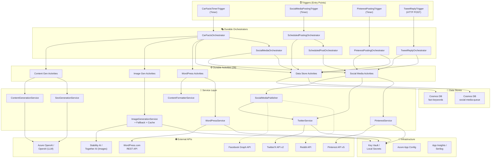

<!-- deepfry:commit=b9be8dc1501e31ea9edfa99c938527818fa2aca5 agent=code-grapher timestamp=2025-07-17T12:00:00Z -->

# Code Structure Graph — CarFacts

> .NET 8 Azure Functions v4 (isolated worker) app that generates daily car-history blog posts via AI, publishes to WordPress, and distributes content across social media platforms on a schedule using Durable Functions orchestrators.

## Tech Stack

| Layer | Technology |
|-------|-----------|
| Runtime | .NET 8, Azure Functions v4 (isolated worker) |
| Orchestration | Durable Task Framework (Durable Functions) |
| AI / LLM | Microsoft Semantic Kernel → Azure OpenAI / OpenAI |
| Image Gen | Stability AI (primary), Together AI (fallback) |
| CMS | WordPress.com REST API v1.1 (OAuth2) |
| Data Store | Azure Cosmos DB (fact-keywords + social-media-queue containers) |
| Secrets | Azure Key Vault (prod) / local config (dev) |
| Config | Azure App Configuration |
| Social | Twitter/X API v2 (OAuth1.0a), Facebook Graph API, Reddit API, Pinterest API v5 |
| Logging | Serilog (local file), Application Insights (Azure) |

---

## Entry Points

| Entry | File | Type | Trigger | Description |
|-------|------|------|---------|-------------|
| `CarFactsTimerTrigger` | `Functions/CarFactsTimerTrigger.cs:21` | Timer | `%Schedule:CronExpression%` (default 6 AM UTC) | Main daily pipeline — starts `CarFactsOrchestrator` |
| `SocialMediaPostingTrigger` | `Functions/SocialMediaPostingTrigger.cs:21` | Timer | `%SocialMedia:PostingCronExpression%` | Reads pending queue items → starts `ScheduledPostingOrchestrator` |
| `PinterestPostingTrigger` | `Functions/PinterestPostingTrigger.cs:26` | Timer | `%SocialMedia:PinterestPostingCronExpression%` | Posts one pin → starts `PinterestPostingOrchestrator` |
| `TweetReplyTrigger` | `Functions/TweetReplyTrigger.cs:22` | HTTP POST | Function-level auth | Manual/scheduled tweet reply generation |
| `Program.cs` | `Program.cs:1` | Host bootstrap | — | DI registration, config, Serilog setup |

---

## Module Map

### Configuration
- **Path**: `Configuration/`
- **Type**: Infrastructure
- **Key classes**:
  - `AISettings` → Text/Image provider selection, model IDs, endpoints (`AppSettings.cs:3`)
  - `StabilityAISettings` → Image model, dimensions, steps (`AppSettings.cs:21`)
  - `TogetherAISettings` → Fallback image model config (`AppSettings.cs:33`)
  - `WordPressSettings` → Site ID, post status, embed options (`AppSettings.cs:43`)
  - `KeyVaultSettings` → Vault URI (`AppSettings.cs:54`)
  - `ScheduleSettings` → Cron expression (`AppSettings.cs:61`)
  - `CosmosDbSettings` → Database/container names (`AppSettings.cs:68`)
  - `WebStoriesSettings` → Web story toggle, publisher info (`AppSettings.cs:76`)
  - `SocialMediaSettings` → Per-platform toggles, daily counts, engagement ranges (`AppSettings.cs:85`)
  - `SecretNames` → All Key Vault secret name constants (`SecretNames.cs:7`)
  - `PinterestBoardTaxonomy` → Rule-based board routing by keyword matching (`PinterestBoardTaxonomy.cs:8`)

### Models
- **Path**: `Models/`
- **Type**: Shared DTOs
- **Key classes**:
  - `CarFact` → year, catchyTitle, fact, carModel, imagePrompt (`CarFact.cs:5`)
  - `RawCarFactsContent` → List of `CarFact` from LLM (`RawCarFactsContent.cs:9`)
  - `SeoMetadata` → mainTitle, metaDescription, keywords, factKeywords (`SeoMetadata.cs:9`)
  - `GeneratedImage` → factIndex, imageData bytes, fileName (`GeneratedImage.cs`)
  - `UploadedMedia` → factIndex, mediaId, sourceUrl (`UploadedMedia.cs`)
  - `WordPressPostResult` → postId, postUrl, title, publishedAt (`WordPressPostResult.cs`)
  - `FactKeywordRecord` → Cosmos DB document for backlinks + social tracking (`FactKeywordRecord.cs:9`)
  - `SocialMediaQueueItem` → Cosmos DB document for scheduled posts with TTL (`SocialMediaQueueItem.cs:9`)
  - `BacklinkSuggestion` / `RelatedPostSuggestion` → Cross-post linking suggestions (`BacklinkSuggestion.cs`)
  - Activity I/O DTOs: `UploadImageInput`, `PublishInput`, `StoreFactKeywordsInput`, `FindBacklinksInput`, `SocialMediaOrchestratorInput`, `ScheduledPostInput`, `TweetReplyResult`, `TweetLikeResult`, `PinterestFactSelection`, `CreateWebStoryInput`, etc. (`ActivityInputs.cs`)

### Prompts
- **Path**: `Prompts/`
- **Type**: Infrastructure (embedded resources)
- **Key classes**:
  - `PromptLoader` → Loads embedded `.txt` prompts with template substitution (`PromptLoader.cs:6`)
- **Embedded resources**: `SystemPrompt.txt`, `UserPrompt.txt`, `SeoSystemPrompt.txt`, `SeoUserPrompt.txt`, `TweetFactsSystemPrompt.txt`, `TweetFactsUserPrompt.txt`, `TweetLinkPrompt.txt`, `TweetReplySystemPrompt.txt`, `TweetReplyUserPrompt.txt`

### Helpers
- **Path**: `Helpers/`
- **Type**: Infrastructure (utilities)
- **Key classes**:
  - `UsPostingScheduler` → Generates US-friendly posting times across 4 daily windows with jitter (`UsPostingScheduler.cs:14`)
  - `SlugHelper` → Generates URL-friendly anchor IDs from car model + year (`SlugHelper.cs:9`)

### Services — AI / Content Generation
- **Path**: `Services/`
- **Type**: Service
- **Exposes**: `IContentGenerationService`, `ISeoGenerationService`
- **Depends on**: `IChatCompletionService` (Semantic Kernel), `PromptLoader`
- **Key classes**:
  - `ContentGenerationService` → Generates 5 car facts via LLM chat completion (`ContentGenerationService.cs:11`)
  - `SeoGenerationService` → Separate LLM pass to generate SEO metadata from facts (`SeoGenerationService.cs:17`)

### Services — Image Generation
- **Path**: `Services/`
- **Type**: Integration
- **Exposes**: `IImageGenerationService`
- **Depends on**: `ISecretProvider`, `StabilityAISettings`, `TogetherAISettings`
- **Key classes**:
  - `ImageGenerationService` → Stability AI text-to-image with 429 retry (`ImageGenerationService.cs:11`)
  - `TogetherAIImageGenerationService` → Together AI (FLUX) fallback provider (`TogetherAIImageGenerationService.cs:15`)
  - `FallbackImageGenerationService` → Decorator: tries providers in order, returns `[]` if all fail (`FallbackImageGenerationService.cs:12`)
  - `CachedImageGenerationService` → Decorator: local disk cache for dev (`CachedImageGenerationService.cs:12`)

### Services — WordPress
- **Path**: `Services/`
- **Type**: Integration
- **Exposes**: `IWordPressService`
- **Depends on**: `HttpClient`, `ISecretProvider`, `WordPressSettings`
- **Key classes**:
  - `WordPressService` → Full WordPress.com REST API client: create draft, upload images, update+publish, web stories (`WordPressService.cs:16`)

### Services — Content Formatting
- **Path**: `Services/`
- **Type**: Service
- **Exposes**: `IContentFormatterService`
- **Depends on**: `SlugHelper`
- **Key classes**:
  - `ContentFormatterService` → Builds Schema.org-annotated HTML with ToC, fact sections, images, backlinks, FAQ, related posts (`ContentFormatterService.cs:9`)

### Services — Social Media
- **Path**: `Services/`
- **Type**: Integration
- **Exposes**: `ISocialMediaService`, `ITwitterService`, `IPinterestService`
- **Depends on**: `HttpClient`, `ISecretProvider`, `SocialMediaSettings`
- **Key classes**:
  - `TwitterService` → X API v2: post, search, reply, like via OAuth1.0a HMAC-SHA1 (`TwitterService.cs:16`)
  - `FacebookService` → Facebook Graph API page posting (`FacebookService.cs:14`)
  - `RedditService` → Reddit OAuth2 link submissions (`RedditService.cs:15`)
  - `PinterestService` → Pinterest API v5: create pins, manage boards (`PinterestService.cs:17`)
  - `SocialMediaPublisher` → Fan-out publisher: dispatches to all enabled `ISocialMediaService` instances (`SocialMediaPublisher.cs:10`)

### Services — Data / Cosmos DB
- **Path**: `Services/`
- **Type**: Repository
- **Exposes**: `IFactKeywordStore`, `ISocialMediaQueueStore`
- **Depends on**: `CosmosClient`, `CosmosDbSettings`
- **Key classes**:
  - `CosmosFactKeywordStore` → CRUD + keyword search on `fact-keywords` container (`CosmosFactKeywordStore.cs:10`)
  - `CosmosSocialMediaQueueStore` → CRUD + scheduled item queries on `social-media-queue` container (`CosmosSocialMediaQueueStore.cs:10`)
  - `NullFactKeywordStore` / `NullSocialMediaQueueStore` → No-op fallbacks when Cosmos is unconfigured

### Services — Secrets
- **Path**: `Services/`
- **Type**: Infrastructure
- **Exposes**: `ISecretProvider`
- **Key classes**:
  - `KeyVaultSecretProvider` → Azure Key Vault via `DefaultAzureCredential` (prod) (`KeyVaultSecretProvider.cs:10`)
  - `LocalSecretProvider` → Reads from `Secrets:*` config section (dev) (`LocalSecretProvider.cs:7`)

### Functions — Orchestrators
- **Path**: `Functions/`
- **Type**: API (Durable Functions orchestrators)
- **Key classes**:
  - `CarFactsOrchestrator` → Main 8-step pipeline: generate → SEO+images → backlinks → draft → upload → publish → social queue → web story (`CarFactsOrchestrator.cs:10`)
  - `SocialMediaOrchestrator` → Generate tweet facts + link tweets → store in queue per enabled platform (`SocialMediaOrchestrator.cs:13`)
  - `ScheduledPostingOrchestrator` → Read pending Cosmos items → fan-out to `ScheduledPostOrchestrator` sub-instances (`ScheduledPostingOrchestrator.cs:14`)
  - `ScheduledPostOrchestrator` → Per-item: durable timer sleep → execute post (handles reply/like placeholders with retries) (`ScheduledPostOrchestrator.cs:14`)
  - `PinterestPostingOrchestrator` → Select fact → generate pin content → create pin → update tracking (`PinterestPostingOrchestrator.cs:14`)
  - `TweetReplyOrchestrator` → Search Twitter → generate AI reply → store in queue (`TweetReplyOrchestrator.cs:13`)

### Functions — Activities (28 total)
- **Path**: `Functions/Activities/`
- **Type**: API (Durable Functions activity functions)
- **Key activities**:
  - `GenerateRawContentActivity` → calls `IContentGenerationService.GenerateFactsAsync`
  - `GenerateSeoActivity` → calls `ISeoGenerationService.GenerateSeoAsync`
  - `GenerateAllImagesActivity` → calls `IImageGenerationService.GenerateImagesAsync`
  - `CreateDraftPostActivity` → calls `IWordPressService.CreateDraftPostAsync`
  - `UploadSingleImageActivity` → calls `IWordPressService.UploadSingleImageAsync`
  - `FormatAndPublishActivity` → calls `IContentFormatterService` + `IWordPressService.UpdateAndPublishPostAsync`
  - `FindBacklinksActivity` → calls `IFactKeywordStore.FindRelatedFactsAsync`
  - `StoreFactKeywordsActivity` → calls `IFactKeywordStore.UpsertFactsAsync`
  - `StoreSocialMediaQueueActivity` → calls `ISocialMediaQueueStore.AddItemsAsync`
  - `GetPendingScheduledItemsActivity` → calls `ISocialMediaQueueStore.GetPendingScheduledItemsAsync`
  - `ExecuteScheduledPostActivity` → calls `SocialMediaPublisher.PublishRawAsync` / `ITwitterService.ReplyToTweetAsync` / `ITwitterService.LikeTweetAsync`
  - `GenerateTweetFactsActivity` → calls `IChatCompletionService` with tweet prompts
  - `GenerateTweetLinkActivity` → calls `IChatCompletionService` with link tweet prompts
  - `GenerateTweetReplyActivity` → calls `ITwitterService.SearchRecentTweetsAsync` + `IChatCompletionService`
  - `GenerateTweetLikeActivity` → calls `ITwitterService.SearchRecentTweetsAsync`
  - `SelectPinterestFactActivity` → calls `IFactKeywordStore.GetFactsForPinterestAsync` + `PinterestBoardTaxonomy`
  - `GeneratePinContentActivity` → calls `IChatCompletionService` for pin title/description
  - `CreatePinterestPinActivity` → calls `IPinterestService.CreatePinAsync`
  - `UpdatePinterestTrackingActivity` → calls `IFactKeywordStore.IncrementPinterestCountAsync`
  - `CreateWebStoryActivity` → calls `IWordPressService.CreateWebStoryAsync`
  - `GetEnabledPlatformsActivity` → calls `SocialMediaPublisher.GetEnabledPlatformNames`
  - `IncrementSocialCountsActivity` → calls `IFactKeywordStore.IncrementSocialCountsAsync`

---

## Dependency Injection Registry

### Settings (Options pattern)

| Settings Class | Config Section | Registered In |
|---------------|---------------|---------------|
| `AISettings` | `AI` | `Program.cs:65` |
| `KeyVaultSettings` | `KeyVault` | `Program.cs:66` |
| `StabilityAISettings` | `StabilityAI` | `Program.cs:67` |
| `TogetherAISettings` | `TogetherAI` | `Program.cs:68` |
| `WordPressSettings` | `WordPress` | `Program.cs:69` |
| `WebStoriesSettings` | `WebStories` | `Program.cs:70` |
| `ScheduleSettings` | `Schedule` | `Program.cs:71` |
| `SocialMediaSettings` | `SocialMedia` | `Program.cs:72` |
| `CosmosDbSettings` | `CosmosDb` | `Program.cs:73` |

### Services

| Interface / Abstract | Concrete Implementation | Lifetime | Condition |
|---------------------|------------------------|----------|-----------|
| `ISecretProvider` | `LocalSecretProvider` | Singleton | Dev (`isLocal`) |
| `ISecretProvider` | `KeyVaultSecretProvider` | Singleton | Prod |
| `Kernel` | Semantic Kernel instance | Singleton | Always (`Program.cs:162`) |
| `IChatCompletionService` | Extracted from Kernel | Singleton | Always (`Program.cs:163`) |
| `IContentGenerationService` | `ContentGenerationService` | Singleton | Always (`Program.cs:97`) |
| `ISeoGenerationService` | `SeoGenerationService` | Singleton | Always (`Program.cs:98`) |
| `IContentFormatterService` | `ContentFormatterService` | Singleton | Always (`Program.cs:101`) |
| `IWordPressService` | `WordPressService` | HttpClient | Always (`Program.cs:102`) |
| `IImageGenerationService` | `CachedImageGenerationService` → `ImageGenerationService` | Singleton | Dev + StabilityAI |
| `IImageGenerationService` | `CachedImageGenerationService` → `TogetherAIImageGenerationService` | Singleton | Dev + TogetherAI |
| `IImageGenerationService` | `FallbackImageGenerationService` → [StabilityAI, TogetherAI] | Singleton | Prod (`Program.cs:201`) |
| `ISocialMediaService` | `TwitterService` | HttpClient+Singleton | Always (`Program.cs:105-107`) |
| `ITwitterService` | `TwitterService` (same instance) | Singleton | Always (`Program.cs:107`) |
| `ISocialMediaService` | `FacebookService` | HttpClient+Singleton | Always (`Program.cs:108-109`) |
| `ISocialMediaService` | `RedditService` | HttpClient+Singleton | Always (`Program.cs:110-111`) |
| `SocialMediaPublisher` | `SocialMediaPublisher` | Singleton | Always (`Program.cs:112`) |
| `IPinterestService` | `PinterestService` | HttpClient+Singleton | Always (`Program.cs:115-116`) |
| `IFactKeywordStore` | `CosmosFactKeywordStore` | Singleton | When Cosmos configured (`Program.cs:247`) |
| `IFactKeywordStore` | `NullFactKeywordStore` | Singleton | No Cosmos (`Program.cs:252`) |
| `ISocialMediaQueueStore` | `CosmosSocialMediaQueueStore` | Singleton | When Cosmos configured (`Program.cs:248`) |
| `ISocialMediaQueueStore` | `NullSocialMediaQueueStore` | Singleton | No Cosmos (`Program.cs:253`) |
| `CosmosClient` | `CosmosClient` | Singleton | When connection string available (`Program.cs:239`) |

---

## Key Flows

### Flow 1: Daily Car Facts Pipeline (main)

```
CarFactsTimerTrigger.Run()                          [Timer: %Schedule:CronExpression%]
  → DurableClient.ScheduleNewOrchestrationInstanceAsync("CarFactsOrchestrator")

CarFactsOrchestrator.RunOrchestrator()
  │
  ├─ Step 1: GenerateRawContentActivity              [LLM retry ×3]
  │    → ContentGenerationService.GenerateFactsAsync()
  │      → IChatCompletionService (Azure OpenAI / OpenAI)
  │        → PromptLoader.LoadSystemPrompt() + LoadUserPrompt()
  │      → returns RawCarFactsContent (5 CarFacts)
  │
  ├─ Shuffle facts (deterministic GUID seed)
  │
  ├─ Step 2+3 (parallel):
  │  ├─ GenerateSeoActivity                           [LLM retry ×3]
  │  │    → SeoGenerationService.GenerateSeoAsync()
  │  │      → IChatCompletionService
  │  │      → returns SeoMetadata
  │  │
  │  └─ GenerateAllImagesActivity                     [Image retry ×3]
  │       → IImageGenerationService.GenerateImagesAsync()
  │         → StabilityAI API (or TogetherAI fallback → empty list)
  │         → returns List<GeneratedImage>
  │
  ├─ Step 3.5: FindBacklinksActivity                  [best-effort]
  │    → IFactKeywordStore.FindRelatedFactsAsync()    [Cosmos DB query]
  │    → IFactKeywordStore.FindRelatedPostCandidatesAsync()
  │    → returns BacklinksResult
  │
  ├─ Step 4: CreateDraftPostActivity
  │    → WordPressService.CreateDraftPostAsync()
  │      → POST wordpress.com/rest/v1.1/sites/{id}/posts/new (status=draft)
  │
  ├─ Step 5: Fan-out UploadSingleImageActivity ×N     [parallel]
  │    → WordPressService.UploadSingleImageAsync()
  │      → POST wordpress.com/.../media/new (multipart)
  │
  ├─ Step 6: FormatAndPublishActivity
  │    → ContentFormatterService.FormatPostHtml()      [builds Schema.org HTML]
  │    → WordPressService.UpdateAndPublishPostAsync()
  │      → POST wordpress.com/.../posts/{id} (status=publish)
  │
  ├─ Step 7 (parallel, best-effort):
  │  ├─ SocialMediaOrchestrator (sub-orchestrator)     → see Flow 2
  │  └─ StoreFactKeywordsActivity
  │       → IFactKeywordStore.UpsertFactsAsync()       [Cosmos DB upsert]
  │
  └─ Step 8: CreateWebStoryActivity                   [if enabled, best-effort]
       → WordPressService.CreateWebStoryAsync()
```

### Flow 2: Social Media Content Queue Generation

```
SocialMediaOrchestrator.Run()                        [sub-orchestrator from Flow 1]
  │
  ├─ Step 1 (parallel):
  │  ├─ GenerateTweetFactsActivity
  │  │    → IChatCompletionService
  │  │      → PromptLoader.LoadTweetFactsSystemPrompt() + UserPrompt()
  │  │    → returns List<TweetFactResult> (N standalone fact tweets)
  │  │
  │  └─ GenerateTweetLinkActivity
  │       → IChatCompletionService
  │         → PromptLoader.LoadTweetLinkPrompt()
  │       → returns List<TweetLinkResult> (link promotion tweets)
  │
  ├─ Step 2: GetEnabledPlatformsActivity
  │    → SocialMediaPublisher.GetEnabledPlatformNames()
  │
  └─ Step 3: StoreSocialMediaQueueActivity
       → UsPostingScheduler.GenerateSchedule()         [US time windows with jitter]
       → UsPostingScheduler.GenerateInterspersedSlots() [reply placeholders]
       → UsPostingScheduler.GenerateClubbedLikeSlots()  [like clusters]
       → ISocialMediaQueueStore.AddItemsAsync()         [Cosmos DB: social-media-queue]
```

### Flow 3: Scheduled Social Media Posting

```
SocialMediaPostingTrigger.Run()                      [Timer: %SocialMedia:PostingCronExpression%]
  → DurableClient.ScheduleNewOrchestrationInstanceAsync("ScheduledPostingOrchestrator")

ScheduledPostingOrchestrator.Run()
  ├─ GetPendingScheduledItemsActivity
  │    → ISocialMediaQueueStore.GetPendingScheduledItemsAsync()  [Cosmos DB query]
  │
  └─ Fan-out: ScheduledPostOrchestrator ×N             [one per queue item]

ScheduledPostOrchestrator.Run(ScheduledPostInput)
  ├─ await context.CreateTimer(scheduledAtUtc)          [durable timer sleep]
  │
  ├─ IF activity="reply" + no content:
  │    → GenerateTweetReplyActivity (up to 3 attempts)
  │      → ITwitterService.SearchRecentTweetsAsync()    [Twitter API v2 search]
  │      → IChatCompletionService                       [generate reply via AI]
  │    → ExecuteScheduledPostActivity
  │      → ITwitterService.ReplyToTweetAsync()          [POST twitter.com/2/tweets]
  │
  ├─ IF activity="like" + no target:
  │    → GenerateTweetLikeActivity (up to 3 attempts)
  │      → ITwitterService.SearchRecentTweetsAsync()
  │    → ExecuteScheduledPostActivity
  │      → ITwitterService.LikeTweetAsync()             [POST twitter.com/2/users/{id}/likes]
  │
  └─ ELSE (regular post):
       → ExecuteScheduledPostActivity
         → SocialMediaPublisher.PublishRawAsync()        [dispatches to platform service]
```

### Flow 4: Pinterest Pin Posting

```
PinterestPostingTrigger.Run()                        [Timer: %SocialMedia:PinterestPostingCronExpression%]
  → (guard: PinterestEnabled?)
  → DurableClient.ScheduleNewOrchestrationInstanceAsync("PinterestPostingOrchestrator")

PinterestPostingOrchestrator.Run()
  ├─ Step 1: SelectPinterestFactActivity
  │    → IFactKeywordStore.GetFactsForPinterestAsync() [Cosmos: ORDER BY pinterestCount ASC]
  │    → PinterestBoardTaxonomy.SelectBoard()           [rule-based keyword → board routing]
  │    → returns PinterestFactSelection
  │
  ├─ Step 2: GeneratePinContentActivity
  │    → IChatCompletionService                         [generate pin title/description]
  │    → returns PinContent
  │
  ├─ Step 3: CreatePinterestPinActivity
  │    → IPinterestService.GetOrCreateBoardAsync()      [Pinterest API v5: boards]
  │    → IPinterestService.CreatePinAsync()             [Pinterest API v5: pins]
  │    → returns pinId
  │
  └─ Step 4: UpdatePinterestTrackingActivity
       → IFactKeywordStore.IncrementPinterestCountAsync() [Cosmos: pinterestCount++]
```

### Flow 5: Tweet Reply Generation (on-demand)

```
TweetReplyTrigger.Run()                              [HTTP POST, Function-level auth]
  → DurableClient.ScheduleNewOrchestrationInstanceAsync("TweetReplyOrchestrator")

TweetReplyOrchestrator.Run()
  ├─ Step 1: GenerateTweetReplyActivity
  │    → ITwitterService.SearchRecentTweetsAsync()      [search "car" tweets, filter replyable]
  │    → IChatCompletionService                         [generate contextual reply]
  │      → PromptLoader.LoadTweetReplySystemPrompt() + UserPrompt()
  │    → returns TweetReplyResult
  │
  └─ Step 2: StoreTweetReplyQueueActivity
       → ISocialMediaQueueStore.AddItemsAsync()          [queue for scheduled execution]
```

---

## Layer Diagram



---

## Cross-Cutting Concerns

| Concern | Implementation | Applied Via |
|---------|---------------|-------------|
| Logging | Serilog (local file) + Application Insights (Azure) | `Program.cs:13-27` host builder + DI |
| Secrets | Azure Key Vault (prod) / `IConfiguration` (dev) | `ISecretProvider` abstraction, env-conditional DI |
| Configuration | Azure App Configuration + `IOptions<T>` pattern | `Program.cs:30-42` + `RegisterSettings()` |
| Retry / Resilience | Durable Functions `RetryPolicy` per activity type | Orchestrators (LLM ×3, Image ×3, WordPress ×3, Social ×2) |
| Image Fallback | `FallbackImageGenerationService` decorator chain | DI in prod: StabilityAI → TogetherAI → empty |
| Image Caching | `CachedImageGenerationService` decorator | DI in dev: wraps real provider |
| Rate Limiting | Sequential image gen + 2s delay + exponential backoff on 429 | `ImageGenerationService.cs:31,96-115` |
| Scheduling | `UsPostingScheduler` generates US-friendly times with jitter | Social queue storage activities |
| Content TTL | `SocialMediaQueueItem.Ttl = 172800` (48h) | Cosmos DB auto-delete |
| Schema.org SEO | Structured data markup in HTML output | `ContentFormatterService` |
| Board Routing | `PinterestBoardTaxonomy` keyword-based board selection | `SelectPinterestFactActivity` |

---

## Data Flow Summary

```
Daily Timer
    ↓
[Azure OpenAI] → 5 CarFacts + SeoMetadata
    ↓
[Stability AI / Together AI] → 5 Images
    ↓
[Cosmos DB: fact-keywords] ← backlink lookup → BacklinkSuggestions
    ↓
[WordPress.com] → Draft → Upload Images → Format HTML → Publish
    ↓
[Azure OpenAI] → Tweet Facts + Link Tweets + Pin Content
    ↓
[Cosmos DB: social-media-queue] ← scheduled items with US-friendly times
    ↓
Posting Timer (daily)
    ↓
[Durable Timers] → sleep until scheduled time
    ↓
[Twitter/Pinterest/Facebook/Reddit APIs] → execute post/reply/like
```

---

## Notes

- **Single .csproj**: All code lives in `src/CarFacts.Functions/` — no multi-project solution
- **Test project**: `tests/CarFacts.Functions.Tests/` exists with tests for Functions, Helpers, and Services
- **Infrastructure**: `infra/azuredeploy.json` ARM template for Azure deployment
- **28 activity functions** in `Functions/Activities/` — each is a thin wrapper calling one service method
- **Orchestrator replay safety**: All orchestrators use `context.CreateReplaySafeLogger()` and deterministic operations
- **Social media platforms**: Twitter is fully active; Facebook and Reddit are registered but controlled by per-platform `Enabled` toggles
- **Pinterest board taxonomy**: 10 keyword-based boards + 1 default, prevents LLM-generated board sprawl via `PinterestBoardTaxonomy`
