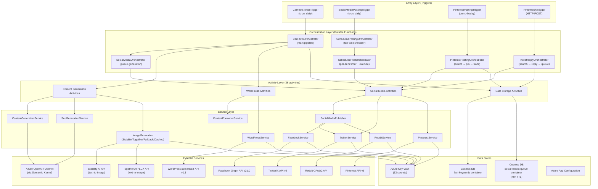

# Code Structure Graph — CarFacts

> **Generated**: Auto-generated code graph for AI model comprehension  
> **Solution**: `CarFacts.sln` — .NET 8 Azure Functions v4 (Isolated Worker)  
> **Architecture**: Durable Functions orchestrator pipeline with fan-out/fan-in  
> **Purpose**: Daily automated blog post generation (car facts) with AI content, image generation, WordPress publishing, and multi-platform social media distribution

---

## Entry Points

| Entry | File | Type | Trigger | Description |
|-------|------|------|---------|-------------|
| `CarFactsTimerTrigger` | `src/CarFacts.Functions/Functions/CarFactsTimerTrigger.cs:22` | Timer (cron) | `%Schedule:CronExpression%` (default `0 0 6 * * *`) | Starts daily content pipeline → `CarFactsOrchestrator` |
| `SocialMediaPostingTrigger` | `src/CarFacts.Functions/Functions/SocialMediaPostingTrigger.cs:22` | Timer (cron) | `%SocialMedia:PostingCronExpression%` | Starts scheduled social media posting → `ScheduledPostingOrchestrator` |
| `PinterestPostingTrigger` | `src/CarFacts.Functions/Functions/PinterestPostingTrigger.cs:26` | Timer (cron) | `%SocialMedia:PinterestPostingCronExpression%` (6x/day) | Posts one pin → `PinterestPostingOrchestrator` |
| `TweetReplyTrigger` | `src/CarFacts.Functions/Functions/TweetReplyTrigger.cs:23` | HTTP POST | `AuthorizationLevel.Function` | Manual/scheduled tweet reply → `TweetReplyOrchestrator` |
| `Program.cs` | `src/CarFacts.Functions/Program.cs:1` | Host bootstrap | — | Configures DI, Serilog, Azure App Configuration, Semantic Kernel |

---

## Module Map

### CarFacts.Functions (Main Project)
- **Path**: `src/CarFacts.Functions/`
- **Type**: Azure Functions App (Isolated Worker, .NET 8)
- **Framework**: `Microsoft.Azure.Functions.Worker` v2.0.0 + Durable Task v1.1.6
- **Key NuGet**: Semantic Kernel 1.47.0, Azure.Cosmos 3.43.1, Serilog

#### Sub-modules by folder:

### Functions/ — Orchestrators & Triggers
- **Path**: `src/CarFacts.Functions/Functions/`
- **Type**: API / Entry Layer (Azure Functions triggers + Durable orchestrators)
- **Key classes**:
  - `CarFactsTimerTrigger` → Timer entry, schedules `CarFactsOrchestrator`
  - `CarFactsOrchestrator` → **Main pipeline**: content gen → SEO → images → WordPress → social → keywords
  - `SocialMediaOrchestrator` → Sub-orchestrator: generates tweet facts + link tweets, stores in queue
  - `ScheduledPostingOrchestrator` → Reads pending queue items from Cosmos, fans-out to per-item orchestrators
  - `ScheduledPostOrchestrator` → Per-item: durable timer sleep → execute post (handles post/reply/like)
  - `PinterestPostingOrchestrator` → Select fact → generate pin content → create pin → update tracking
  - `TweetReplyOrchestrator` → Search Twitter → AI-generate reply → store in queue
  - `SocialMediaPostingTrigger` → Timer trigger for scheduled posting
  - `PinterestPostingTrigger` → Timer trigger for Pinterest posting
  - `TweetReplyTrigger` → HTTP trigger for tweet replies

### Functions/Activities/ — Durable Activity Functions
- **Path**: `src/CarFacts.Functions/Functions/Activities/`
- **Type**: Service Layer (Durable activity wrappers — thin delegates to Services)
- **26 activities** — each wraps a single service call:

| Activity | Service Dependency | Purpose |
|----------|-------------------|---------|
| `GenerateRawContentActivity` | `IContentGenerationService` | LLM generates 5 car facts |
| `GenerateSeoActivity` | `ISeoGenerationService` | LLM generates SEO metadata |
| `GenerateAllImagesActivity` | `IImageGenerationService` | Sequential image generation (rate-limited) |
| `CreateDraftPostActivity` | `IWordPressService` | Creates WordPress draft (gets post ID) |
| `UploadSingleImageActivity` | `IWordPressService` | Uploads one image to WordPress media |
| `FormatAndPublishActivity` | `IContentFormatterService` + `IWordPressService` | Formats HTML, publishes/updates post |
| `FindBacklinksActivity` | `IFactKeywordStore` | Finds related facts for internal linking |
| `StoreFactKeywordsActivity` | `IFactKeywordStore` | Stores fact keywords + increments backlink counts |
| `GenerateTweetFactsActivity` | `IChatCompletionService` | LLM generates standalone tweet content |
| `GenerateTweetLinkActivity` | `IChatCompletionService` | LLM generates blog link tweets |
| `StoreSocialMediaQueueActivity` | `ISocialMediaQueueStore` | Stores scheduled posts in Cosmos |
| `GetEnabledPlatformsActivity` | `SocialMediaPublisher` | Returns list of enabled platform names |
| `GetSocialMediaSettingsActivity` | `SocialMediaSettings` | Reads social config |
| `GetPendingScheduledItemsActivity` | `ISocialMediaQueueStore` | Reads pending queue items |
| `ExecuteScheduledPostActivity` | `SocialMediaPublisher` + `ITwitterService` + stores | Posts/replies/likes + cleanup |
| `GenerateTweetReplyActivity` | `ITwitterService` + `IChatCompletionService` | Search Twitter → AI reply |
| `GenerateTweetLikeActivity` | `ITwitterService` | Search Twitter → select tweet to like |
| `SelectPinterestFactActivity` | `IFactKeywordStore` | Selects lowest-pinned fact |
| `GeneratePinContentActivity` | `IChatCompletionService` | LLM generates pin title/description |
| `CreatePinterestPinActivity` | `IPinterestService` | Creates pin via Pinterest API v5 |
| `UpdatePinterestTrackingActivity` | `IFactKeywordStore` | Increments pinterest counts |
| `IncrementSocialCountsActivity` | `IFactKeywordStore` | Increments platform social counts |
| `GetWebStoriesEnabledActivity` | `WebStoriesSettings` | Checks if web stories enabled |
| `CreateWebStoryActivity` | `IWordPressService` | Creates AMP Web Story |
| `PublishSocialMediaActivity` | `SocialMediaPublisher` | Legacy direct social post |
| `StoreTweetReplyQueueActivity` | `ISocialMediaQueueStore` | Stores reply in queue |

### Services/ — Business Logic
- **Path**: `src/CarFacts.Functions/Services/`
- **Type**: Service Layer
- **Key classes**:
  - `ContentGenerationService` → Uses `IChatCompletionService` (Semantic Kernel) + embedded prompts
  - `SeoGenerationService` → Separate LLM pass for SEO metadata
  - `ImageGenerationService` → Stability AI REST API (text-to-image)
  - `TogetherAIImageGenerationService` → Together AI FLUX API (alternative image gen)
  - `CachedImageGenerationService` → Decorator: local disk cache for dev
  - `FallbackImageGenerationService` → Chain: StabilityAI → TogetherAI → empty (prod only)
  - `ContentFormatterService` → Builds HTML: TOC, fact sections, FAQ, backlinks, related posts
  - `WordPressService` → WordPress.com REST API v1.1 (OAuth2 bearer)
  - `TwitterService` → X/Twitter API v2 (OAuth 1.0a): post, search, reply, like
  - `FacebookService` → Facebook Graph API v21.0
  - `RedditService` → Reddit OAuth2 API
  - `PinterestService` → Pinterest API v5 (OAuth2 bearer): pins, boards
  - `SocialMediaPublisher` → Fan-out to all enabled `ISocialMediaService` implementations
  - `KeyVaultSecretProvider` → Azure Key Vault (production)
  - `LocalSecretProvider` → `IConfiguration["Secrets:*"]` (dev)
  - `CosmosFactKeywordStore` → Cosmos DB `fact-keywords` container
  - `CosmosSocialMediaQueueStore` → Cosmos DB `social-media-queue` container
  - `NullFactKeywordStore` → No-op when Cosmos DB unavailable
  - `NullSocialMediaQueueStore` → No-op when Cosmos DB unavailable

### Services/Interfaces/ — Contracts
- **Path**: `src/CarFacts.Functions/Services/Interfaces/`
- **Type**: Interface Layer
- **11 interfaces**:
  - `IContentGenerationService` → `GenerateFactsAsync(todayDate)`
  - `ISeoGenerationService` → `GenerateSeoAsync(content)`
  - `IImageGenerationService` → `GenerateImagesAsync(facts)`
  - `IWordPressService` → Upload images, create/update/publish posts, web stories
  - `IContentFormatterService` → `FormatPostHtml(content, seo, media, date, backlinks, relatedPosts)`
  - `ISocialMediaService` → `PostAsync(teaser, url, title, keywords)` + `PostRawAsync(content)`
  - `ITwitterService` → `SearchRecentTweetsAsync`, `ReplyToTweetAsync`, `LikeTweetAsync`
  - `IPinterestService` → `CreatePinAsync`, `ListBoardsAsync`, `GetOrCreateBoardAsync`
  - `ISecretProvider` → `GetSecretAsync(secretName)`
  - `IFactKeywordStore` → CRUD for fact keywords, backlinks, social counts, Pinterest tracking
  - `ISocialMediaQueueStore` → Queue CRUD for scheduled social posts

### Models/ — Data Transfer Objects
- **Path**: `src/CarFacts.Functions/Models/`
- **Type**: Data Layer (DTOs)
- **Key models**:
  - `CarFact` → `{Year, CatchyTitle, Fact, CarModel, ImagePrompt}`
  - `RawCarFactsContent` → `{Facts: List<CarFact>}` — LLM output
  - `SeoMetadata` → `{MainTitle, MetaDescription, Keywords, GeoSummary, SocialMediaTeaser, FactKeywords}`
  - `GeneratedImage` → `{FactIndex, ImageData: byte[], FileName}`
  - `UploadedMedia` → `{FactIndex, MediaId, SourceUrl}`
  - `WordPressPostResult` → `{PostId, PostUrl, Title, PublishedAt}`
  - `FactKeywordRecord` → Cosmos DB document: fact keywords, backlink/social/pinterest counters
  - `SocialMediaQueueItem` → Cosmos DB document: queued social post with scheduled time + 48h TTL
  - `BacklinkSuggestion` → Internal backlink from current post to previous fact
  - `RelatedPostSuggestion` → "Related posts" section suggestion
  - `CarFactsResponse` → Legacy combined response (bridged in formatter)
  - Activity input DTOs: `PublishInput`, `UploadImageInput`, `SocialPublishInput`, `StoreFactKeywordsInput`, `FindBacklinksInput`, `SocialMediaOrchestratorInput`, `StoreSocialQueueInput`, `ScheduledPostInput`, `CreateWebStoryInput`, `GeneratePinContentInput`, `CreatePinterestPinInput`, `UpdatePinterestTrackingInput`, etc.

### Configuration/ — Settings POCOs
- **Path**: `src/CarFacts.Functions/Configuration/`
- **Type**: Infrastructure
- **Classes**:
  - `AISettings` → Text/image provider selection, Azure OpenAI endpoint, model names
  - `StabilityAISettings` → Model, resolution, steps, cfg_scale
  - `TogetherAISettings` → Model, resolution, steps
  - `WordPressSettings` → SiteId, username, post status
  - `KeyVaultSettings` → VaultUri
  - `CosmosDbSettings` → DatabaseName, ContainerName
  - `ScheduleSettings` → CronExpression
  - `SocialMediaSettings` → Per-platform toggles, engagement counts, Pinterest cron
  - `WebStoriesSettings` → Enabled toggle, publisher metadata
  - `SecretNames` → Static constants for all Key Vault secret names (13 secrets)
  - `PinterestBoardTaxonomy` → Rule-based keyword → board mapping (10 boards)

### Prompts/ — Embedded LLM Prompts
- **Path**: `src/CarFacts.Functions/Prompts/`
- **Type**: Infrastructure (embedded resources)
- **Files**: `SystemPrompt.txt`, `UserPrompt.txt`, `SeoSystemPrompt.txt`, `SeoUserPrompt.txt`, `TweetFactsSystemPrompt.txt`, `TweetFactsUserPrompt.txt`, `TweetLinkPrompt.txt`, `TweetReplySystemPrompt.txt`, `TweetReplyUserPrompt.txt`, `PinterestPinSystemPrompt.txt`, `PinterestPinUserPrompt.txt`
- **Loader**: `PromptLoader.cs` — loads from assembly embedded resources, replaces `{{DATE}}`, `{{CONTENT}}`, `{{COUNT}}`, `{{POST_TITLE}}`, `{{POST_URL}}`, `{{ORIGINAL_TWEET}}` placeholders

### Helpers/
- **Path**: `src/CarFacts.Functions/Helpers/`
- **Type**: Utility
- **Classes**:
  - `SlugHelper` → Generates URL-safe anchor IDs from `CarFact` (e.g., `"bmw-3-0-csl-1972"`)
  - `UsPostingScheduler` → Generates US-timezone-aware posting schedules across 4 windows (Morning/Lunch/Evening/Dinner) with jitter and minimum gaps

### CarFacts.Functions.Tests (Test Project)
- **Path**: `tests/CarFacts.Functions.Tests/`
- **Type**: Unit Tests
- **Depends on**: `CarFacts.Functions`

---

## Dependency Injection Registry

> Source: `src/CarFacts.Functions/Program.cs:61-255`

### Settings (Options Pattern)

| Settings Class | Config Section | Registered In |
|----------------|---------------|---------------|
| `AISettings` | `AI` | `Program.cs:65` |
| `KeyVaultSettings` | `KeyVault` | `Program.cs:66` |
| `StabilityAISettings` | `StabilityAI` | `Program.cs:67` |
| `TogetherAISettings` | `TogetherAI` | `Program.cs:68` |
| `WordPressSettings` | `WordPress` | `Program.cs:69` |
| `WebStoriesSettings` | `WebStories` | `Program.cs:70` |
| `ScheduleSettings` | `Schedule` | `Program.cs:71` |
| `SocialMediaSettings` | `SocialMedia` | `Program.cs:72` |
| `CosmosDbSettings` | `CosmosDb` | `Program.cs:73` |

### Services

| Interface | Concrete (Local) | Concrete (Prod) | Lifetime | Registered In |
|-----------|-------------------|------------------|----------|---------------|
| `ISecretProvider` | `LocalSecretProvider` | `KeyVaultSecretProvider` | Singleton | `Program.cs:86-88` |
| `Kernel` (Semantic Kernel) | — | — | Singleton | `Program.cs:162` |
| `IChatCompletionService` | Extracted from SK Kernel | Extracted from SK Kernel | Singleton | `Program.cs:163` |
| `IContentGenerationService` | `ContentGenerationService` | `ContentGenerationService` | Singleton | `Program.cs:97` |
| `ISeoGenerationService` | `SeoGenerationService` | `SeoGenerationService` | Singleton | `Program.cs:98` |
| `IImageGenerationService` | `CachedImageGenerationService` (wraps provider) | `FallbackImageGenerationService` (chain) | Singleton | `Program.cs:166-209` |
| `IContentFormatterService` | `ContentFormatterService` | `ContentFormatterService` | Singleton | `Program.cs:101` |
| `IWordPressService` | `WordPressService` | `WordPressService` | Singleton (HttpClient) | `Program.cs:102` |
| `ISocialMediaService` (multi) | `TwitterService` | `TwitterService` | Singleton | `Program.cs:105-106` |
| `ISocialMediaService` (multi) | `FacebookService` | `FacebookService` | Singleton | `Program.cs:108-109` |
| `ISocialMediaService` (multi) | `RedditService` | `RedditService` | Singleton | `Program.cs:110-111` |
| `ITwitterService` | `TwitterService` | `TwitterService` | Singleton | `Program.cs:107` |
| `SocialMediaPublisher` | `SocialMediaPublisher` | `SocialMediaPublisher` | Singleton | `Program.cs:112` |
| `IPinterestService` | `PinterestService` | `PinterestService` | Singleton | `Program.cs:115-116` |
| `IFactKeywordStore` | `NullFactKeywordStore` (no Cosmos) / `CosmosFactKeywordStore` | `CosmosFactKeywordStore` | Singleton | `Program.cs:247-254` |
| `ISocialMediaQueueStore` | `NullSocialMediaQueueStore` / `CosmosSocialMediaQueueStore` | `CosmosSocialMediaQueueStore` | Singleton | `Program.cs:248-254` |
| `CosmosClient` | — | `CosmosClient` (with camelCase) | Singleton | `Program.cs:239-246` |

### Image Provider Strategy (conditional DI)

```
Local:
  AI:ImageProvider = "StabilityAI"  → CachedImageGenerationService(ImageGenerationService)
  AI:ImageProvider = "TogetherAI"   → CachedImageGenerationService(TogetherAIImageGenerationService)
  AI:ImageProvider = "None"         → no registration

Production:
  Always → FallbackImageGenerationService([ImageGenerationService, TogetherAIImageGenerationService])
```

### Text Provider Strategy (conditional DI)

```
AI:TextProvider = "OpenAI"       → Kernel.AddOpenAIChatCompletion(model, key)
AI:TextProvider = "AzureOpenAI"  → Kernel.AddAzureOpenAIChatCompletion(deployment, endpoint, key)
```

---

## Key Flows

### Flow 1: Daily Content Pipeline (Main — `CarFactsOrchestrator`)

```
CarFactsTimerTrigger.Run()                          [Timer: cron]
  → DurableClient.ScheduleNewOrchestrationInstanceAsync(CarFactsOrchestrator)

CarFactsOrchestrator.RunOrchestrator()               [Orchestrator]
  │
  ├─ Step 1: GenerateRawContentActivity               [Activity]
  │    → ContentGenerationService.GenerateFactsAsync()
  │      → IChatCompletionService (Semantic Kernel)
  │        → Azure OpenAI / OpenAI API
  │      → Parse JSON → RawCarFactsContent (5 facts)
  │
  ├─ Shuffle facts (replay-safe random)
  │
  ├─ Steps 2+3 (PARALLEL):
  │  ├─ GenerateSeoActivity                            [Activity]
  │  │    → SeoGenerationService.GenerateSeoAsync()
  │  │      → IChatCompletionService → SeoMetadata
  │  │
  │  └─ GenerateAllImagesActivity                      [Activity]
  │       → IImageGenerationService.GenerateImagesAsync()
  │         → [Prod] FallbackImageGenerationService
  │           → StabilityAI API (text-to-image) / TogetherAI FLUX API
  │         → [Dev] CachedImageGenerationService → disk cache
  │
  ├─ Step 3.5: FindBacklinksActivity                   [Activity, best-effort]
  │    → IFactKeywordStore.FindRelatedFactsAsync()
  │    → IFactKeywordStore.FindRelatedPostCandidatesAsync()
  │      → Cosmos DB (fact-keywords container)
  │
  ├─ Step 4: CreateDraftPostActivity                   [Activity]
  │    → WordPressService.CreateDraftPostAsync()
  │      → WordPress.com REST API v1.1
  │
  ├─ Step 5: UploadSingleImageActivity × N             [Fan-out, parallel]
  │    → WordPressService.UploadSingleImageAsync()
  │      → WordPress.com media upload
  │
  ├─ Step 6: FormatAndPublishActivity                  [Activity]
  │    → ContentFormatterService.FormatPostHtml()      (HTML: TOC, facts, FAQ, backlinks)
  │    → WordPressService.UpdateAndPublishPostAsync()
  │      → WordPress.com REST API (publish)
  │
  ├─ Steps 7+8 (PARALLEL, best-effort):
  │  ├─ SocialMediaOrchestrator                        [Sub-orchestrator] (see Flow 2)
  │  ├─ StoreFactKeywordsActivity                      [Activity]
  │  │    → IFactKeywordStore.UpsertFactsAsync()
  │  │    → IFactKeywordStore.IncrementBacklinkCountsAsync()
  │  │      → Cosmos DB
  │  └─ CreateWebStoryActivity (if enabled)            [Activity]
  │       → WordPressService.CreateWebStoryAsync()
  │
  └─ Return: PostUrl
```

### Flow 2: Social Media Queue Generation (`SocialMediaOrchestrator`)

```
SocialMediaOrchestrator.Run()                        [Sub-orchestrator]
  │
  ├─ PARALLEL:
  │  ├─ GenerateTweetFactsActivity                     [Activity]
  │  │    → IChatCompletionService
  │  │      → LLM generates N standalone car fact tweets
  │  │
  │  └─ GenerateTweetLinkActivity                      [Activity]
  │       → IChatCompletionService
  │         → LLM generates blog link tweets
  │
  ├─ GetEnabledPlatformsActivity                       [Activity]
  │    → SocialMediaPublisher.GetEnabledPlatformNames()
  │
  └─ StoreSocialMediaQueueActivity                     [Activity]
       → UsPostingScheduler.GenerateSchedule()        (US-friendly times)
       → UsPostingScheduler.GenerateInterspersedSlots() (reply times)
       → UsPostingScheduler.GenerateClubbedLikeSlots() (like batches)
       → ISocialMediaQueueStore.AddItemsAsync()
         → Cosmos DB (social-media-queue, 48h TTL)
```

### Flow 3: Scheduled Social Media Posting

```
SocialMediaPostingTrigger.Run()                      [Timer: cron]
  → DurableClient.ScheduleNewOrchestrationInstanceAsync(ScheduledPostingOrchestrator)

ScheduledPostingOrchestrator.Run()                   [Orchestrator]
  ├─ GetPendingScheduledItemsActivity                  [Activity]
  │    → ISocialMediaQueueStore.GetPendingScheduledItemsAsync()
  │      → Cosmos DB
  │
  └─ Fan-out: ScheduledPostOrchestrator × N            [Sub-orchestrator per item]

ScheduledPostOrchestrator.Run()                      [Per-item orchestrator]
  ├─ context.CreateTimer(scheduledAtUtc)               [Durable timer sleep]
  │
  ├─ If activity="reply" (placeholder):
  │    → GenerateTweetReplyActivity (up to 3 attempts)
  │      → ITwitterService.SearchRecentTweetsAsync()   → Twitter API v2
  │      → IChatCompletionService                      → LLM generates reply
  │    → ExecuteScheduledPostActivity
  │      → ITwitterService.ReplyToTweetAsync()
  │
  ├─ If activity="like" (placeholder):
  │    → GenerateTweetLikeActivity (up to 3 attempts)
  │      → ITwitterService.SearchRecentTweetsAsync()   → Twitter API v2
  │    → ExecuteScheduledPostActivity
  │      → ITwitterService.LikeTweetAsync()
  │
  └─ Else (post):
       → ExecuteScheduledPostActivity
         → SocialMediaPublisher.PublishRawAsync()
           → TwitterService.PostRawAsync()             → Twitter API v2
         → ISocialMediaQueueStore.DeleteItemAsync()
         → IFactKeywordStore.IncrementSocialCountsAsync() (link-type only)
```

### Flow 4: Pinterest Posting Pipeline

```
PinterestPostingTrigger.Run()                        [Timer: 6x/day]
  → Check PinterestEnabled flag
  → DurableClient.ScheduleNewOrchestrationInstanceAsync(PinterestPostingOrchestrator)

PinterestPostingOrchestrator.Run()                   [Orchestrator]
  ├─ Step 1: SelectPinterestFactActivity               [Activity]
  │    → IFactKeywordStore.GetFactsForPinterestAsync() (lowest pinterestCount first)
  │    → PinterestBoardTaxonomy.SelectBoard()          (keyword → board mapping)
  │
  ├─ Step 2: GeneratePinContentActivity                [Activity]
  │    → IChatCompletionService → LLM generates pin title + description
  │
  ├─ Step 3: CreatePinterestPinActivity                [Activity]
  │    → IPinterestService.GetOrCreateBoardAsync()     → Pinterest API v5
  │    → IPinterestService.CreatePinAsync()            → Pinterest API v5
  │
  └─ Step 4: UpdatePinterestTrackingActivity           [Activity]
       → IFactKeywordStore.IncrementPinterestCountAsync()
         → Cosmos DB (update counters + board list)
```

### Flow 5: Tweet Reply Generation

```
TweetReplyTrigger.Run()                              [HTTP POST]
  → DurableClient.ScheduleNewOrchestrationInstanceAsync(TweetReplyOrchestrator)

TweetReplyOrchestrator.Run()                         [Orchestrator]
  ├─ GenerateTweetReplyActivity                        [Activity]
  │    → ITwitterService.SearchRecentTweetsAsync()     → Twitter search API v2
  │    → Filter: replySettings="everyone", engagement > threshold
  │    → IChatCompletionService                        → LLM generates reply text
  │    → Return: TweetReplyResult {TweetId, ReplyText, AuthorUsername}
  │
  └─ StoreTweetReplyQueueActivity                      [Activity]
       → ISocialMediaQueueStore.AddItemsAsync()
         → Cosmos DB (queued for scheduled posting)
```

---

## Layer Diagram



---

## Cross-Cutting Concerns

| Concern | Implementation | Applied Via |
|---------|---------------|-------------|
| Logging | Serilog (local file) + Application Insights (prod) | DI: `Program.cs:13-27,47-48` |
| Secrets | Azure Key Vault (prod) / `IConfiguration` (dev) | `ISecretProvider` interface, DI switch |
| Configuration | Azure App Configuration + `local.settings.json` | `Program.cs:31-42` |
| Retry | Durable Functions `RetryPolicy` per activity category | Orchestrators (LLM: 3×5s, Image: 3×10s, WP: 3×3s, Social: 2×5s) |
| Image Resilience | `FallbackImageGenerationService` (prod), `CachedImageGenerationService` (dev) | Conditional DI in `Program.cs:166-209` |
| Scheduling | `UsPostingScheduler` — 4 US time windows with jitter | Used by `StoreSocialMediaQueueActivity` |
| Rate Limiting | 2s delay between Stability AI calls, 429 exponential backoff | `ImageGenerationService.cs:31,96-115` |
| TTL Cleanup | Cosmos DB 48h TTL on `SocialMediaQueueItem` | `SocialMediaQueueItem.cs:52` |
| Replay Safety | `context.CreateReplaySafeLogger`, deterministic `context.NewGuid()` for shuffle | All orchestrators |
| Board Routing | `PinterestBoardTaxonomy` — keyword-based static mapping (10 boards) | `SelectPinterestFactActivity` |

---

## Data Stores Schema

### Cosmos DB: `carfacts` database

| Container | Partition Key | Document Type | TTL |
|-----------|--------------|---------------|-----|
| `fact-keywords` | `/id` | `FactKeywordRecord` | None |
| `social-media-queue` | `/platform` | `SocialMediaQueueItem` | 48h (172800s) |

---

## External API Integrations

| Service | Base URL | Auth | Used By |
|---------|----------|------|---------|
| Azure OpenAI | Configurable endpoint | API Key (Key Vault) | `ContentGenerationService`, `SeoGenerationService`, tweet/pin content gen |
| Stability AI | `https://api.stability.ai/v1/generation/` | Bearer token (Key Vault) | `ImageGenerationService` |
| Together AI | `https://api.together.xyz/v1/images/generations` | Bearer token (Key Vault) | `TogetherAIImageGenerationService` |
| WordPress.com | `https://public-api.wordpress.com/rest/v1.1/sites` | OAuth2 Bearer (Key Vault) | `WordPressService` |
| Twitter/X | `https://api.twitter.com/2/` | OAuth 1.0a (4 secrets from Key Vault) | `TwitterService` |
| Facebook | `https://graph.facebook.com/v21.0` | Page Access Token (Key Vault) | `FacebookService` |
| Reddit | `https://oauth.reddit.com/api/` | OAuth2 script app (Key Vault) | `RedditService` |
| Pinterest | `https://api.pinterest.com/v5` | OAuth2 Bearer (Key Vault) | `PinterestService` |

---

## Notes

- **Skipped**: Individual test files in `tests/`, `infra/azuredeploy.json`, `docs/`, `.github/` workflows, prompt `.txt` content
- **Pattern**: All orchestrators follow the same structure: trigger → orchestrator → activities → services → external APIs
- **Social media**: Twitter is the primary active platform; Facebook and Reddit services exist but are toggled off by default
- **Pinterest**: Operates on an independent timer (6x/day), reuses `FactKeywordRecord` data from the main pipeline
- **Null Object Pattern**: `NullFactKeywordStore` / `NullSocialMediaQueueStore` ensure the pipeline works without Cosmos DB
