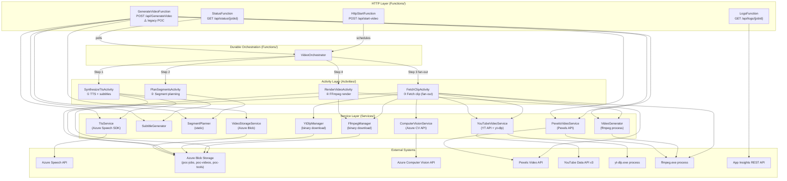

<!-- deepfry:commit=5360e5707b59a6cf919f9c880a227006d8f33b09 agent=code-grapher timestamp=2025-07-14T00:00:00Z -->
# Code Structure Graph — CarFacts.VideoFunction

## Entry Points

| Entry | File | Type | Description |
|-------|------|------|-------------|
| `Program.cs` (top-level) | `Program.cs` | Bootstrap | `HostBuilder` → `ConfigureFunctionsWebApplication()` + DI registration; calls `host.Run()` |
| `HttpStartFunction.StartVideo` | `Functions/HttpStartFunction.cs:29` | HTTP Trigger | `POST /api/start-video` — schedules Durable orchestration, returns 202 + jobId |
| `StatusFunction.GetVideoStatus` | `Functions/StatusFunction.cs:18` | HTTP Trigger | `GET /api/status/{jobId}` — polls Durable instance state |
| `LogsFunction.GetJobLogs` | `Functions/LogsFunction.cs:25` | HTTP Trigger | `GET /api/logs/{jobId}` — queries App Insights traces for a job |
| `GenerateVideoFunction.Run` | `Functions/GenerateVideoFunction.cs:27` | HTTP Trigger | `POST /api/GenerateVideo` — **legacy POC**: synchronous end-to-end in a single HTTP call |
| `VideoOrchestrator.Run` | `Functions/VideoOrchestrator.cs:17` | Orchestration Trigger | Durable orchestrator; chains 4 activities for async video generation |

---

## Module Map

### Functions Layer — `Functions/`

#### `VideoOrchestrator`
- **File**: `Functions/VideoOrchestrator.cs`
- **Type**: Durable Orchestrator Function
- **Trigger**: `[OrchestrationTrigger]`
- **Input**: `OrchestratorInput` (JobId, Fact, StorageConnectionString, PexelsApiKey, YouTubeApiKey, VisionEndpoint, VisionApiKey)
- **Output**: `RenderActivityResult`
- **Key methods**:
  - `Run(TaskOrchestrationContext ctx)` — 4-step sequential pipeline with fan-out at step 3:
    1. `CallActivityAsync<TtsActivityResult>(nameof(SynthesizeTtsActivity), ...)`
    2. `CallActivityAsync<List<VideoSegment>>(nameof(PlanSegmentsActivity), ...)`
    3. `segments.Select(…).Select(ctx.CallActivityAsync<FetchClipActivityResult>)` → `Task.WhenAll(…)` **(fan-out)**
    4. `CallActivityAsync<RenderActivityResult>(nameof(RenderVideoActivity), ...)`
- **Defined records**: `OrchestratorInput` (line 101)

#### `HttpStartFunction`
- **File**: `Functions/HttpStartFunction.cs`
- **Type**: HTTP Function (Durable client)
- **Route**: `POST /api/start-video` (AuthorizationLevel.Function)
- **Injects**: `IConfiguration`, `ILogger<HttpStartFunction>`
- **DurableClient**: `DurableTaskClient client`
- **Key methods**:
  - `Run(...)` — reads `fact` from request body; reads keys from `IConfiguration`; calls `client.ScheduleNewOrchestrationInstanceAsync(nameof(VideoOrchestrator), OrchestratorInput)` → returns 202 with `{ jobId, statusUrl }`
- **Config keys read**: `Storage:ConnectionString`, `Pexels:ApiKey`, `YouTube:ApiKey` (optional), `Vision:Endpoint` (optional), `Vision:ApiKey` (optional)

#### `StatusFunction`
- **File**: `Functions/StatusFunction.cs`
- **Type**: HTTP Function (Durable client)
- **Route**: `GET /api/status/{jobId}` (AuthorizationLevel.Function)
- **Injects**: `ILogger<StatusFunction>`
- **DurableClient**: `DurableTaskClient client`
- **Key methods**:
  - `Run(...)` — calls `client.GetInstanceAsync(jobId, getInputsAndOutputs: true)`; deserializes output as `RenderActivityResult`; returns `{ jobId, status, videoUrl, durationSecs, clipCount, clips[] }`

#### `LogsFunction`
- **File**: `Functions/LogsFunction.cs`
- **Type**: HTTP Function (standalone)
- **Route**: `GET /api/logs/{jobId}` (AuthorizationLevel.Function)
- **Injects**: `IConfiguration`, `ILogger<LogsFunction>`
- **Key methods**:
  - `Run(...)` — reads `AppInsights:ApiKey` from config; calls App Insights REST API (`https://api.applicationinsights.io/v1/apps/{AppInsightsAppId}/query`) with a KQL query filtering traces by jobId; returns structured `{ jobId, totalLogLines, clipActivity[], allLogs[] }`
- **Hard-coded App Insights appId**: `adf71ab0-69e2-4d63-837a-49c287cd6bad`

#### `GenerateVideoFunction` *(Legacy POC — synchronous)*
- **File**: `Functions/GenerateVideoFunction.cs`
- **Type**: HTTP Function (standalone, no Durable)
- **Route**: `POST|GET /api/GenerateVideo` (AuthorizationLevel.Function)
- **Injects**: `FfmpegManager`, `TtsService`, `SubtitleGenerator`, `VideoStorageService`, `PexelsApiKeyHolder`, `ILogger`
- ⚠️ **`VideoStorageService` and `PexelsApiKeyHolder` are not registered in `Program.cs`** — this function will fail to resolve from DI on startup
- **Key methods**:
  - `Run(...)` — inline pipeline: TTS → subtitles → `SegmentPlanner.Plan()` → `PexelsVideoService.ResolveClipsAsync()` → `VideoGenerator.GenerateFromClipsAsync()` → `VideoStorageService.UploadAsync()` → return 200 with `{ videoUrl, durationSeconds, wordCount, clipCount }`

---

### Activities Layer — `Activities/`

#### `SynthesizeTtsActivity` *(Activity 1)*
- **File**: `Activities/SynthesizeTtsActivity.cs`
- **Trigger**: `[ActivityTrigger]`
- **Input**: `TtsActivityInput` (JobId, Fact, StorageConnectionString)
- **Output**: `TtsActivityResult` (AudioUrl, AssSubtitleText, Words, TotalDuration)
- **Injects (constructor)**: `TtsService`, `SubtitleGenerator`, `ILogger<SynthesizeTtsActivity>`
- **Key methods**:
  - `Run(...)` — calls `ttsService.SynthesizeAsync(fact, wavPath)` → `subtitleGenerator.GenerateAss(words, totalDuration, "carfactsdaily.com")` → uploads WAV to blob `poc-jobs/{jobId}/narration.wav` → returns SAS URL + ASS text + word timings
  - `UploadToBlobAsync(connStr, filePath, blobPath)` — private; uploads to Azure Blob, returns 4h SAS URL

#### `PlanSegmentsActivity` *(Activity 2)*
- **File**: `Activities/PlanSegmentsActivity.cs`
- **Trigger**: `[ActivityTrigger]`
- **Input**: `PlanActivityInput` (Words, TotalDuration, Fact)
- **Output**: `List<VideoSegment>`
- **Injects (constructor)**: `ILogger<PlanSegmentsActivity>`
- **Key methods**:
  - `Run(...)` — pure CPU; delegates entirely to `SegmentPlanner.Plan(input.Words, input.TotalDuration, input.Fact)` — no I/O

#### `FetchClipActivity` *(Activity 3 — fan-out, one instance per segment)*
- **File**: `Activities/FetchClipActivity.cs`
- **Trigger**: `[ActivityTrigger]`
- **Input**: `FetchClipActivityInput` (JobId, Index, SearchQuery, Duration, PexelsApiKey, StorageConnectionString, YouTubeApiKey, VisionEndpoint, VisionApiKey, ShotType, FallbackQuery, BrandOnlyFallback)
- **Output**: `FetchClipActivityResult` (Index, ClipUrl, Attribution?)
- **Injects (constructor)**: `FfmpegManager`, `YtDlpManager`, `ILogger<FetchClipActivity>`
- **Instantiates internally (via `new`)**: `ComputerVisionService`, `YouTubeVideoService`
- **Key methods**:
  - `Run(...)` — two-path strategy:
    - *Path A*: `youtubeSvc.FetchClipAsync(query, duration, sourceTmp)` → if `attribution != null`, trim with `TrimClipAsync()` → upload
    - *Path B* (fallback): `SearchPexelsWithFallbackAsync(...)` (4-tier: primary → fallbackQuery → brandOnlyFallback → generic) → download → trim → upload
  - `TrimClipAsync(ffmpegPath, source, output, duration)` — private; spawns `ffmpeg.exe` process, re-encodes to 720×1280 @30fps
  - `UploadClipAsync(connStr, filePath, blobPath)` — private; uploads to `poc-jobs/{jobId}/clip_{index:D2}.mp4`, returns 4h SAS URL
  - `SearchPexelsAsync(query, apiKey)` — private; `GET https://api.pexels.com/videos/search?...`
  - `SearchPexelsWithFallbackAsync(...)` — private; tries up to 4 Pexels queries in order

#### `RenderVideoActivity` *(Activity 4)*
- **File**: `Activities/RenderVideoActivity.cs`
- **Trigger**: `[ActivityTrigger]`
- **Input**: `RenderActivityInput` (JobId, AudioUrl, AssSubtitleText, ClipUrls, TotalDuration, StorageConnectionString, SegmentDurations, ClipSources)
- **Output**: `RenderActivityResult` (VideoUrl, DurationSeconds, ClipCount, ClipSources)
- **Injects (constructor)**: `FfmpegManager`, `ILogger<RenderVideoActivity>`
- **Instantiates internally (via `new`)**: `VideoGenerator(ffmpegPath)`
- **Key methods**:
  - `Run(...)` — downloads audio + clips from blob SAS URLs; writes `subtitles.ass` (no BOM); builds `List<VideoSegment>` with local paths + cumulative durations; calls `generator.GenerateFromClipsAsync()` → uploads to `poc-videos` container, returns 48h SAS URL
  - `DownloadAsync(url, destPath)` — private
  - `UploadVideoAsync(connStr, filePath, blobName)` — private; uploads to container `poc-videos`

---

### Services Layer — `Services/`

#### `TtsService`
- **File**: `Services/TtsService.cs`
- **Lifetime**: Singleton (registered in `Program.cs`)
- **Constructor**: `(subscriptionKey, region, voiceName="en-US-AndrewNeural")`
- **External SDK**: `Microsoft.CognitiveServices.Speech`
- **Key methods**:
  - `SynthesizeAsync(text, outputWavPath) → List<WordTiming>` — builds SSML with `<prosody rate='0.88'>`, hooks `synthesizer.WordBoundary` to capture per-word offsets, writes WAV file, returns `WordTiming[]` (word, startSeconds, durationSeconds)
- **External call**: Azure Cognitive Services Speech API (subscription region)

#### `SubtitleGenerator`
- **File**: `Services/SubtitleGenerator.cs`
- **Lifetime**: Singleton (registered in `Program.cs`)
- **Constructor**: `()` — no dependencies
- **Key methods**:
  - `GenerateAss(words, totalDuration, websiteUrl) → string` — emits `.ass` file content with 3 styles: `Karaoke` (rolling 3-word yellow highlight), `Hook` (last-2s CTA), `Watermark` (ghost overlay). PlayRes: 1080×1920

#### `SegmentPlanner`
- **File**: `Services/SegmentPlanner.cs`
- **Lifetime**: Static class — no DI registration, called directly
- **Key methods**:
  - `Plan(words, totalDuration, factContext) → List<VideoSegment>` — (1) splits at sentence boundaries + pauses ≥0.4s; (2) force-splits groups >3.5s; (3) detects brand+model from fact text using `BrandMap`/`ModelNames`; (4) assigns shuffled shot types (`ShuffleShotTypes`); (5) builds queries via `BuildQuery(brand, model, shot)` + fallback queries
  - `DetectBrand(factText) → string?` — multi-word brands first, then single-word `\b` regex match against `BrandMap` (60+ entries)
  - `DetectModel(factText) → string?` — same pattern against `ModelNames` (~60 entries)
  - `ShuffleShotTypes(count) → List<ShotType>` — Fisher-Yates shuffle over `{ExteriorRolling, InteriorPOV, DroneShot, CloseUp}`
  - `BuildQuery(brand, model, shot) → string` — e.g. `"Ford Mustang exterior rolling b-roll footage"`

#### `FfmpegManager`
- **File**: `Services/FfmpegManager.cs`
- **Lifetime**: Singleton (registered in `Program.cs`)
- **Constructor**: `(storageConnectionString, toolsContainer="poc-tools", blobName="ffmpeg.exe")`
- **Key methods**:
  - `EnsureReadyAsync() → string (path)` — double-checked lock; downloads `ffmpeg.exe` from `poc-tools` blob container to `%TEMP%\poc-ffmpeg-bin\ffmpeg.exe` on first call; static `_cachedPath` field serves warm invocations instantly
- **External call**: Azure Blob Storage (`poc-tools` container, `ffmpeg.exe` blob ~130MB)

#### `YtDlpManager`
- **File**: `Services/YtDlpManager.cs`
- **Lifetime**: Singleton (registered in `Program.cs`)
- **Constructor**: `(storageConnectionString, toolsContainer="poc-tools", blobName="yt-dlp.exe")`
- **Key methods**:
  - `EnsureReadyAsync() → string (path)` — same double-checked lock pattern as `FfmpegManager`; downloads `yt-dlp.exe` to `%TEMP%\poc-ytdlp-bin\yt-dlp.exe`
  - `EnsureCookiesAsync() → string?` — tries to download `youtube-cookies.txt` from `poc-tools`; returns path if found, `null` if blob absent; sentinel `""` prevents re-checking
- **External call**: Azure Blob Storage (`poc-tools` container, `yt-dlp.exe` blob + optional `youtube-cookies.txt`)

#### `VideoGenerator`
- **File**: `Services/VideoGenerator.cs`
- **Lifetime**: Transient — instantiated with `new VideoGenerator(ffmpegPath)` inside `RenderVideoActivity` and `GenerateVideoFunction`; **not registered in DI**
- **Constructor**: `(ffmpegPath = "ffmpeg")`
- **Key methods**:
  - `GenerateAsync(imagePath, audioPath, subtitleFileName, musicPath?, outputPath, duration, fps=30)` — single-image Ken Burns mode (zoompan); overlays ASS subtitles + optional music mix
  - `GenerateFromClipsAsync(segments, audioPath, subtitlePath, musicPath?, outputPath, totalDuration, fps=30)` — multi-clip mode; normalizes each clip (`setsar=1,fps=N`), chains `xfade=transition=fade:duration=0.30` between clips, overlays `subtitles=` filter (libass with `fontsdir=C:/Windows/Fonts`), optionally mixes background music at 12% volume
- **External call**: `ffmpeg.exe` process (spawned as child process)

#### `PexelsVideoService`
- **File**: `Services/PexelsVideoService.cs`
- **Lifetime**: Transient — instantiated with `new PexelsVideoService(apiKey, ffmpegPath, cacheDir)` inside `GenerateVideoFunction`; **not registered in DI**
- **Constructor**: `(apiKey, ffmpegPath, cacheDir)`
- **Key methods**:
  - `ResolveClipsAsync(segments, outputDir) → List<VideoSegment>` — throttled parallel (max 2 concurrent via `SemaphoreSlim`); per-segment: check trim cache → search Pexels → download → trim via ffmpeg → cache trimmed clip
  - `SearchPexelsAsync(query) → string (url)` — `GET https://api.pexels.com/videos/search?...&orientation=portrait`; prefers portrait, picks smallest ≥540px wide MP4
  - `TrimClipAsync(sourcePath, outputPath, duration)` — spawns `ffmpeg.exe`; re-encodes to 720×1280 @30fps, strips audio
- **External call**: `https://api.pexels.com/videos/search` + `ffmpeg.exe` process

#### `YouTubeVideoService`
- **File**: `Services/YouTubeVideoService.cs`
- **Lifetime**: Transient — instantiated with `new YouTubeVideoService(...)` inside `FetchClipActivity.Run()`; **not registered in DI**
- **Constructor**: `(youTubeApiKey, ytDlpPath, visionService, cookiesPath?, ffmpegPath?)`
- **Key methods**:
  - `FetchClipAsync(query, duration, outputPath) → string? (attribution)` — calls `FindBestCandidateAsync()` then `DownloadClipAsync()`; returns attribution string or null
  - `FindBestCandidateAsync(query) → YouTubeClip?` — `SearchAsync()` → `ScoreTitle()` filter → top-5 checked via `visionService.AnalyzeThumbnailAsync()`; skips watermarked or carless thumbnails
  - `SearchAsync(query)` — `GET https://www.googleapis.com/youtube/v3/search?videoLicense=creativeCommon&videoDefinition=high&videoDuration=short&maxResults=10`
  - `ScoreTitle(title)` — returns -1 for titles with skip terms (reviews, vlogs…); +2 for each prefer term (footage, b-roll…)
  - `DownloadClipAsync(videoId, duration, outputPath) → bool` — spawns `yt-dlp.exe --download-sections "*0-{duration}" --remux-video mp4`; uses `PYINSTALLER_TMPDIR` env var to share extraction cache across parallel instances; cookies arg if available
- **External calls**: YouTube Data API v3, `yt-dlp.exe` process

#### `ComputerVisionService`
- **File**: `Services/ComputerVisionService.cs`
- **Lifetime**: Transient — instantiated with `new ComputerVisionService(endpoint, apiKey)` inside `FetchClipActivity.Run()`; **not registered in DI**
- **Constructor**: `(endpoint, apiKey)`
- **External SDK**: `Azure.AI.Vision.ImageAnalysis`
- **Key methods**:
  - `AnalyzeThumbnailAsync(videoId) → ThumbnailAnalysis(HasWatermark, HasCar)` — analyzes `https://img.youtube.com/vi/{videoId}/hqdefault.jpg` via `ImageAnalysisClient`; requests `VisualFeatures.Read | VisualFeatures.Tags`
  - `CheckWatermark(result)` — scans `result.Read.Blocks` for text in the 4 corner zones (30%×20% of 480×360); returns `true` if ≥8 chars found in corners
  - `CheckCarPresence(result)` — checks `result.Tags.Values` for car-related terms with confidence ≥ 0.60
- **External call**: Azure Computer Vision REST API

#### `VideoStorageService`
- **File**: `Services/VideoStorageService.cs`
- **Lifetime**: Transient — **not registered in DI in `Program.cs`**; used only in `GenerateVideoFunction` (legacy POC)
- **Constructor**: `(connectionString, containerName)`
- **Key methods**:
  - `UploadAsync(filePath, blobName) → string (sasUrl)` — creates container if needed; uploads MP4; returns 48h SAS URL

#### `PexelsApiKeyHolder`
- **File**: `Services/PexelsApiKeyHolder.cs`
- **Lifetime**: **Not registered in DI in `Program.cs`**; used only in `GenerateVideoFunction` (legacy POC)
- **Constructor**: `(apiKey)`
- **Purpose**: Simple wrapper to hold the Pexels API key string for DI injection

---

### Models Layer — `Models/`

| File | Records / Types |
|------|----------------|
| `Models/WordTiming.cs` | `WordTiming(Word, StartSeconds, DurationSeconds)` — computed `EndSeconds` |
| `Models/VideoSegment.cs` | `VideoSegment(SearchQuery, StartSeconds, EndSeconds, ShotType)` — computed `Duration`; init props `ClipPath`, `FallbackQuery`, `BrandOnlyFallback`; enum `ShotType {ExteriorRolling, InteriorPOV, DroneShot, CloseUp}` |
| `Models/ActivityModels.cs` | **Inputs**: `StartVideoRequest`, `TtsActivityInput`, `PlanActivityInput`, `FetchClipActivityInput`, `RenderActivityInput` · **Outputs**: `TtsActivityResult`, `FetchClipActivityResult`, `RenderActivityResult`, `ClipSource` |

---

## Dependency Injection Registry

*(Registered in `Program.cs` lines 6–36)*

| Concrete Type | Lifetime | Factory | Config Keys |
|---------------|----------|---------|-------------|
| `FfmpegManager` | Singleton | `new FfmpegManager(cfg["Storage:ConnectionString"])` | `Storage:ConnectionString` |
| `YtDlpManager` | Singleton | `new YtDlpManager(cfg["Storage:ConnectionString"])` | `Storage:ConnectionString` |
| `TtsService` | Singleton | `new TtsService(key, region, voice)` | `Speech:Key`, `Speech:Region` (default `"centralindia"`), `Speech:VoiceName` (default `"en-US-AndrewNeural"`) |
| `SubtitleGenerator` | Singleton | `new SubtitleGenerator()` | — |
| `IConfiguration` | Singleton | `services.AddSingleton(cfg)` | — |
| App Insights | — | `AddApplicationInsightsTelemetryWorkerService()` + `ConfigureFunctionsApplicationInsights()` | (auto from APPINSIGHTS_INSTRUMENTATIONKEY) |

**Not in DI** (instantiated with `new` at call sites):

| Type | Instantiated In | Why |
|------|----------------|-----|
| `VideoGenerator` | `RenderVideoActivity.Run()`, `GenerateVideoFunction.Run()` | Needs resolved `ffmpegPath` string at runtime |
| `PexelsVideoService` | `GenerateVideoFunction.Run()` | Legacy POC — not part of Durable path |
| `YouTubeVideoService` | `FetchClipActivity.Run()` | Needs per-activity keys from `FetchClipActivityInput` |
| `ComputerVisionService` | `FetchClipActivity.Run()` | Needs per-activity Vision keys from input |
| `VideoStorageService` | `GenerateVideoFunction` (injected but ⚠️ not registered) | Legacy POC |
| `PexelsApiKeyHolder` | `GenerateVideoFunction` (injected but ⚠️ not registered) | Legacy POC |

---

## Key Flows

### Flow 1: Durable Video Generation (primary path)

```
POST /api/start-video
  → HttpStartFunction.Run()
      reads IConfiguration keys (Storage, Pexels, YouTube, Vision)
      → client.ScheduleNewOrchestrationInstanceAsync("VideoOrchestrator", OrchestratorInput)
      ← returns HTTP 202 { jobId, statusUrl }

VideoOrchestrator.Run(TaskOrchestrationContext)
  │
  ├─ Step 1: ctx.CallActivityAsync<TtsActivityResult>("SynthesizeTtsActivity", TtsActivityInput)
  │     SynthesizeTtsActivity.Run()
  │       → TtsService.SynthesizeAsync(fact, wavPath)          [Azure Speech API]
  │       → SubtitleGenerator.GenerateAss(words, dur, url)
  │       → BlobContainerClient.UploadAsync(wav)               [Azure Blob: poc-jobs/{jobId}/narration.wav]
  │       ← TtsActivityResult(audioUrl, assText, words, totalDuration)
  │
  ├─ Step 2: ctx.CallActivityAsync<List<VideoSegment>>("PlanSegmentsActivity", PlanActivityInput)
  │     PlanSegmentsActivity.Run()
  │       → SegmentPlanner.Plan(words, totalDuration, fact)    [CPU only — no I/O]
  │         splits at sentence boundaries/pauses → force-splits >3.5s
  │         detects brand+model → assigns shuffled shot types
  │         builds SearchQuery + FallbackQuery + BrandOnlyFallback per segment
  │       ← List<VideoSegment>
  │
  ├─ Step 3: Fan-out — Task.WhenAll(segments.Select(FetchClipActivity))
  │     FetchClipActivity.Run()  [× N, all parallel]
  │       ├─ Path A: YouTube CC
  │       │     ytDlpManager.EnsureReadyAsync()               [download yt-dlp.exe on cold start]
  │       │     ytDlpManager.EnsureCookiesAsync()
  │       │     new ComputerVisionService(endpoint, apiKey)
  │       │     new YouTubeVideoService(ytApiKey, ytDlpPath, visionSvc, cookies, ffmpegPath)
  │       │       → YouTubeVideoService.FetchClipAsync(query, duration, sourceTmp)
  │       │           SearchAsync()                           [YouTube Data API v3]
  │       │           ScoreTitle() filter
  │       │           visionService.AnalyzeThumbnailAsync()   [Azure Computer Vision API]
  │       │           DownloadClipAsync()                     [yt-dlp.exe process]
  │       │     TrimClipAsync(ffmpegPath, source, trimmed)    [ffmpeg.exe process]
  │       │
  │       ├─ Path B: Pexels fallback (if YouTube fails/finds nothing)
  │       │     SearchPexelsWithFallbackAsync()               [Pexels REST API — up to 4 tiers]
  │       │     Http.GetAsync(videoUrl)                       [direct video download]
  │       │     TrimClipAsync(ffmpegPath, source, trimmed)    [ffmpeg.exe process]
  │       │
  │       └─ UploadClipAsync()                                [Azure Blob: poc-jobs/{jobId}/clip_NN.mp4]
  │         ← FetchClipActivityResult(index, clipUrl, attribution?)
  │
  └─ Step 4: ctx.CallActivityAsync<RenderActivityResult>("RenderVideoActivity", RenderActivityInput)
        RenderVideoActivity.Run()
          → ffmpegManager.EnsureReadyAsync()
          → DownloadAsync(audioUrl)                           [SAS URL → local narration.wav]
          → File.WriteAllTextAsync(subtitlesAss)
          → DownloadAsync(clipUrl) × N                        [SAS URLs → local clip_NN.mp4]
          → new VideoGenerator(ffmpegPath)
          → generator.GenerateFromClipsAsync(segments, audio, subtitles, null, output, dur)
                                                              [ffmpeg.exe: xfade + libass + AAC encode]
          → UploadVideoAsync()                                [Azure Blob: poc-videos/carfact-{ts}-{jobId}.mp4]
          ← RenderActivityResult(videoUrl, durationSecs, clipCount, clipSources)

GET /api/status/{jobId}
  → StatusFunction.Run()
      → client.GetInstanceAsync(jobId)
      if Completed → deserialize output as RenderActivityResult
      ← { jobId, status, videoUrl, durationSecs, clipCount, clips[] }
```

### Flow 2: Log Inspection

```
GET /api/logs/{jobId}
  → LogsFunction.Run()
      reads AppInsights:ApiKey from IConfiguration
      → GET https://api.applicationinsights.io/v1/apps/{AppInsightsAppId}/query
             KQL: traces | where message has '{jobId}' | order by timestamp asc
      ← { jobId, totalLogLines, clipActivity[], allLogs[] }
```

### Flow 3: Legacy Synchronous Path *(POC only — ⚠️ DI broken for VideoStorageService / PexelsApiKeyHolder)*

```
POST|GET /api/GenerateVideo
  → GenerateVideoFunction.Run()
      ffmpegManager.EnsureReadyAsync()
      ttsService.SynthesizeAsync(fact, wavPath)
      subtitleGenerator.GenerateAss(words, dur, url)
      SegmentPlanner.Plan(words, dur, fact)
      new PexelsVideoService(apiKey, ffmpegPath, cacheDir)
        → ResolveClipsAsync(segments, tempDir)                [Pexels API + ffmpeg trim; max 2 concurrent]
      new VideoGenerator(ffmpegPath)
        → GenerateFromClipsAsync(clips, audio, subtitles, null, output, dur)
      storageService.UploadAsync(outputPath, blobName)         [Azure Blob]
      ← { videoUrl, durationSeconds, wordCount, clipCount }
```

---

## Layer Diagram



---

## Cross-Cutting Concerns

| Concern | Implementation | Applied Via |
|---------|---------------|-------------|
| Telemetry / Logging | Application Insights + `ILogger<T>` | `AddApplicationInsightsTelemetryWorkerService()` + `ConfigureFunctionsApplicationInsights()` in Program.cs; `[JobId]` prefix on all log messages |
| Authorization | Function-level API keys | `AuthorizationLevel.Function` on all HTTP triggers |
| Binary caching | Static fields in `FfmpegManager` / `YtDlpManager` | Double-checked lock + `static string? _cachedPath`; warm invocations skip blob download |
| Temp isolation | Per-job/activity temp directories | `Path.Combine(Path.GetTempPath(), "tts-{jobId}")` etc.; `finally { Directory.Delete(tempDir, recursive: true) }` cleanup |
| Blob SAS URLs | Azure SAS tokens | 4h for intermediate blobs (audio, clips); 48h for final video |
| Clip fallback strategy | 4-tier Pexels + YouTube CC | `FetchClipActivity`: YouTube CC first → Pexels primary query → FallbackQuery → BrandOnlyFallback → generic `"car driving road footage"` |
| Concurrency control | `SemaphoreSlim` | `FfmpegManager.Lock` (1,1), `YtDlpManager.Lock` (1,1), `PexelsVideoService.DownloadSem` (2,2) |
| Subtitle format | ASS (Advanced SubStation Alpha) | `SubtitleGenerator.GenerateAss()` — 1080×1920 PlayRes, Arial 86pt, karaoke rolling-3-word yellow highlight |
| YouTube bot detection bypass | Cookies + multi-client args | `YtDlpManager.EnsureCookiesAsync()` + `--extractor-args youtube:player_client=mweb,tv_embedded,ios,android` |
| Cost guard (CV skip) | Optimistic fallback on CV failure | `ComputerVisionService.AnalyzeThumbnailAsync()` returns `HasWatermark=false, HasCar=true` on exception |

---

## Configuration Reference

| Key | Used By | Default / Required |
|-----|---------|-------------------|
| `Storage:ConnectionString` | `FfmpegManager`, `YtDlpManager`, `HttpStartFunction` (→ orchestrator) | **Required** |
| `Speech:Key` | `TtsService` | **Required** |
| `Speech:Region` | `TtsService` | `"centralindia"` |
| `Speech:VoiceName` | `TtsService` | `"en-US-AndrewNeural"` |
| `Pexels:ApiKey` | `HttpStartFunction` (→ `FetchClipActivityInput`) | **Required** |
| `YouTube:ApiKey` | `HttpStartFunction` (→ `FetchClipActivityInput`) | Optional — Pexels-only if empty |
| `Vision:Endpoint` | `HttpStartFunction` (→ `FetchClipActivityInput`) | Optional — CV check skipped if empty |
| `Vision:ApiKey` | `HttpStartFunction` (→ `FetchClipActivityInput`) | Optional |
| `AppInsights:ApiKey` | `LogsFunction` | Optional — logs endpoint returns guidance if absent |
